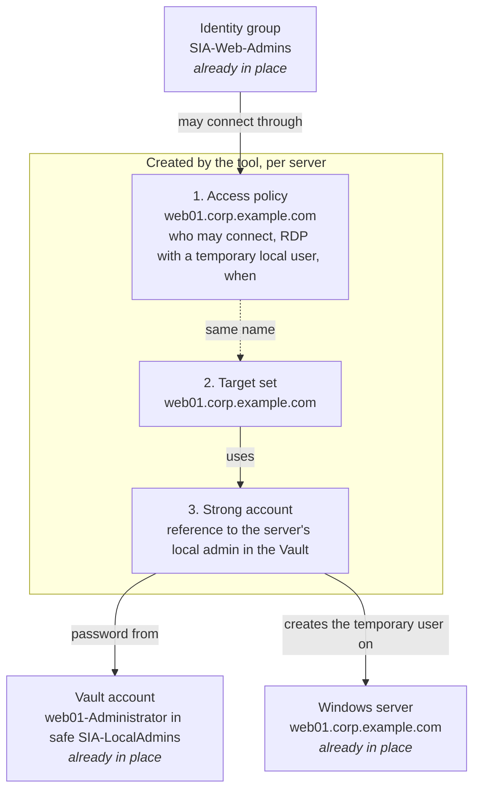

# sia-policy-automation

Onboard Windows servers into CyberArk / Idira **Secure Infrastructure Access (SIA)** from a spreadsheet.

For every server it creates the three things SIA needs for zero-standing-privilege RDP: the server's **strong
account** (its local administrator, referenced from your Vault), a **target set**, and an **access policy** named
after the server. It works for 5 servers or 70,000, can be run again at any time without changing anything that is
already right, and picks up where it stopped if interrupted.

```text
python sia_onboard.py preflight                    # can I reach the tenant?
python sia_onboard.py plan  --input input          # what would change? (changes nothing)
python sia_onboard.py apply --input input          # do it
python sia_onboard.py verify --input input         # is every server ready? PASS / FAIL
python sia_onboard.py connect-info --input input   # what users type into their RDP client
```

## How it works



For each Windows server in your list the tool:

1. makes sure SIA has a **strong account** for it — either the shared account for the server's AD domain
   (listed once per domain in `domains.csv`), or a reference to the server's own local admin account in the
   Vault, found by a naming convention you set once (safe `SIA-LocalAdmins`, account `<hostname>-Administrator`);
2. creates a **target set** pointing at that account: one per server, or one per AD domain when the account is
   shared;
3. creates the **access policy**: which Identity group may connect, by RDP with a temporary local user, for how long.

Linux servers get only a policy (SIA uses an SSH certificate there). A second group on the same server is just a
second row with a `policy_suffix`.

**When a user connects**, they open **Access › Infrastructure** in the portal, search the server, and click
**Connect › RDP**. SIA finds the policy, uses the strong account to create a temporary local user on the server,
opens the session, and deletes that user when the session ends (after 2 hours, or 10 idle minutes, by default).
Nobody types a password. `connect-info` exports the same connection for RDP clients (gateway
`<subdomain>.rdp.cyberark.cloud`, user name `secureaccess /i alice@acme.cyberark.cloud /s acme /a web01.corp.example.com`).
Details: [How a user connects](docs/OPERATIONS.md#2-how-a-user-connects).

## Install

You need Python 3.11 or newer (<https://www.python.org/downloads/>; on Windows tick *Add python.exe to PATH*).

1. Get the tool: **Code → Download ZIP** on GitHub, or `git clone https://github.com/uakbr/sia-policy-automation.git`.
2. Open a terminal in the folder and install the one dependency:

   ```powershell
   python -m venv .venv
   .\.venv\Scripts\Activate.ps1          # Windows PowerShell (macOS/Linux: source .venv/bin/activate)
   pip install -r requirements.txt
   ```

   Run the *Activate* line again whenever you open a new terminal.
3. Copy `config.example.toml` to `config.toml` and set these lines (the file explains the rest):

   ```toml
   [tenant]
   subdomain    = "acme"                                # from https://acme.cyberark.cloud
   identity_url = "https://abc1234.id.cyberark.cloud"   # Identity Administration › Settings › Customization › Tenant URLs

   [defaults]
   time_zone = "America/New_York"
   days_of_week = [0, 1, 2, 3, 4, 5, 6]                 # when users may connect (0 = Sunday)
   from_hour = ""                                       # "" = all day
   to_hour = ""
   target_set_cert_validation = false                   # true once servers have valid WinRM certificates
   strong_account_safe_template = "SIA-LocalAdmins"     # where the servers' local admin accounts live in the Vault
   strong_account_account_name_template = "{hostname}-Administrator"   # their account name in the Vault
   strong_account_username_template = "Administrator"   # their Windows user name
   ```

4. Copy `.env.example` to `.env` and put in the service user (an Identity user flagged **Is OAuth confidential
   client**, member of the **Secure Infrastructure Access administrator** role):

   ```dotenv
   SIA_CLIENT_ID=svc_sia_automation@acme.cyberark.cloud
   SIA_CLIENT_SECRET=its-password
   ```

   Leave the secret out to be prompted instead. Never share `config.toml` or `.env`.
5. Check the connection:

   ```text
   python sia_onboard.py preflight
   ```

   Every line should say `OK`. If not, see [Troubleshooting](docs/OPERATIONS.md#8-troubleshooting).

**Before the first server**, three things must be true on your side: a local administrator account for every
server exists in the Vault under the naming convention above (the tool can onboard missing ones through PVWA, see
the operations guide), the SIA connectors reach the servers over WinRM (TCP 5985/5986), and local accounts have
`LocalAccountTokenFilterPolicy = 1` (a GPO setting).

## Your list: `input/servers.csv`

One row per policy. Usually that is one row per server; a second group gets a second row.

```csv
fqdn,strong_account,group,policy_name,policy_suffix,assign_groups,domain,description,protocol,ssh_username,domain_joined
web01.corp.example.com,,SIA-Web-Admins,,,,,,,,
web01.corp.example.com,,SIA-Platform-Ops,,-ops,Remote Desktop Users,,,,,
web02.corp.example.com,,SIA-Web-Admins,,,,,,,,
app-lnx01.corp.example.com,,SIA-Linux-Admins,,,,,,ssh,ec2-user,
```

| Column | Fill in |
|---|---|
| `fqdn` | The server name exactly as users will connect to it. **The only required column.** |
| `group` | The Identity group that may connect (several: `SIA-Web-Admins;SIA-Platform-Ops`). Leave empty to derive it from the server name — see below. |
| `policy_suffix` | Only for a second policy on the same server, e.g. `-ops`. |
| `assign_groups` | Local groups the temporary user joins; empty = `Administrators`. |
| `protocol`, `ssh_username` | `ssh` and the certificate user name for Linux servers; empty = Windows/RDP. |
| `strong_account` | Leave empty. Only for the few servers that need a specific account declared in `strong_accounts.csv`. |
| `domain_joined` | `no` for a workgroup server, so it gets its own local account instead of its domain's. |
| `policy_name`, `domain`, `description` | Optional overrides; the example file shows them. |

Column names must match exactly; every problem is reported with its line number and nothing is touched until
the files are clean.

## Deriving the group and the strong account

Filling in a group and a strong account per server does not scale past a few hundred rows. Two conventions
remove both columns.

**The group comes from the server name.** Set it once in `config.toml`:

```toml
[defaults]
group_template = "SIA-{hostname_upper}-RDP"     # server ABC123 -> group SIA-ABC123-RDP
```

Templates may use `{hostname}`, `{fqdn}`, `{domain}` and the `{hostname_upper}` / `{hostname_lower}` /
`{domain_upper}` variants. A `group` typed into a row always wins.

**The strong account comes from the server's AD domain.** List your domains once in `input/domains.csv`:

```csv
domain,strong_account,target_set,target_set_type,group_template,description
corp.example.com,SA-CORP-SIA,,Domain,,
dmz.example.com,SA-DMZ-SIA,,Domain,SIA-{hostname_upper}-DMZ,
```

| Column | Fill in |
|---|---|
| `domain` | The AD domain, exactly as it appears at the end of the servers' FQDNs. |
| `strong_account` | The domain account already onboarded into SIA. The tool only looks it up — it never creates it. |
| `target_set` | The target set holding that account; empty = the domain name. |
| `target_set_type` | `Domain` (every machine in the domain, the default) or `Suffix` (every machine under a DNS suffix). `Target` scopes a set to one machine, so it is only valid together with an explicit `target_set`. |
| `group_template` | Overrides `[defaults] group_template` for this domain only. |

Then `servers.csv` is just a list of names, and `strong_accounts.csv` is only needed for the exceptions:

```csv
fqdn
web01.corp.example.com
web02.corp.example.com
```

**How a server picks its strong account**, in order: the `strong_account` cell → its domain's row in
`domains.csv` (domain-joined servers only) → `[defaults] strong_account_template`, the per-host local
administrator. So a workgroup server (`domain_joined = no`) always falls through to its own local account,
and both kinds can sit in the same file.

**One target set per domain instead of one per server.** A domain account works on every machine in its
domain, so it does not need a target set per server. Set `target_set_scope = "auto"` in `config.toml` and
each domain gets a single `Domain` target set — 24 objects instead of 24,000. Workgroup servers keep their
own `Target` set. The default, `server`, keeps one target set per server for everyone.

`groups.csv` is only needed when a group name exists in two directories.

## Run it

**`plan`** shows one line per row and changes nothing:

```text
Servers:
  Server                      Strong account  Policy                      Secret   Target set  Policy
  web01.corp.example.com      ADM-web01       web01.corp.example.com      planned  planned     planned
  web01.corp.example.com      ADM-web01       web01.corp.example.com-ops  planned  planned     planned
  web02.corp.example.com      ADM-web02       web02.corp.example.com      planned  planned     planned
  app-lnx01.corp.example.com  -               app-lnx01.corp.example.com  n/a      n/a         planned

Summary: n/a=1, planned=8
```

**`apply`** shows the plan again, asks you to type `yes`, then creates the objects in order (strong accounts,
target sets, policies) and prints the same table with `created`. Run it again and everything says `exists`.
Anything that differs from your list is shown as `drift`, never changed silently.

**`verify`** prints `PASS`, `MISSING` or `FAIL` per row and is what you hand to whoever signs the change off.
**`connect-info --rdp-dir out`** writes a CSV with the connection settings per server and one `.rdp` file each.

Start with one server, test the login as a member of the group, then load the real list.
[What the results mean](docs/OPERATIONS.md#1-what-the-results-mean) explains every status.

## Big lists

- Work in waves: `--offset 0 --limit 5000`, then `--offset 5000 --limit 5000`, and `verify` after each.
- Add `--workers 8` and set `max_requests_per_second = 10` in `config.toml`.
- Interrupted? Run the same `apply` again with `--resume`; finished rows are skipped.

More in [Large rollouts](docs/OPERATIONS.md#6-large-rollouts).

## One server at a time (from a build job)

`--server` replaces `servers.csv` for a single run, so a newly built server can be onboarded from the same
job that builds it. `domains.csv`, `strong_accounts.csv` and `groups.csv` are still read, so the group and
strong account resolve exactly as they would in a bulk run:

```bash
python sia_onboard.py apply --server web09.corp.example.com --yes --json --no-report
```

`--json` puts the result on stdout (the table goes to stderr) and the exit code is `0` success, `1` something
needs attention, `2` bad input or configuration. Add `--group NAME` to name the group explicitly,
`--workgroup` for a server that is not domain-joined.

## Behind a TLS-inspecting proxy

Export the proxy's root CA and point the tool at it, rather than turning verification off:

```bash
python sia_onboard.py --ca-bundle /path/to/corp-root-ca.pem preflight
```

Or set `ca_bundle` under `[http]` in `config.toml` to make it permanent. `preflight` prints which bundle is
in use.

## Safety

`plan` writes nothing. `apply` asks before changing anything, never deletes, only touches objects it created
(or that you `--adopt`), stops at the first rejected create instead of failing for every server, and never prints
a password.

## More

- [docs/OPERATIONS.md](docs/OPERATIONS.md) — results, how users connect, first time on a tenant, strong accounts
  in detail, day-to-day changes, large rollouts, troubleshooting, FAQ, glossary, open items.
- [docs/DEVELOPER.md](docs/DEVELOPER.md) — architecture, API calls, tests.
- [docs/sia-onboarding-flow.html](docs/sia-onboarding-flow.html) — a one-page visual explainer.
