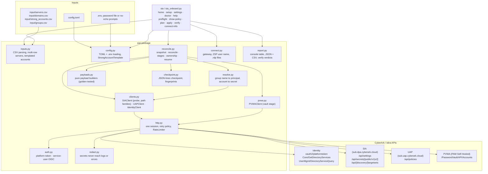
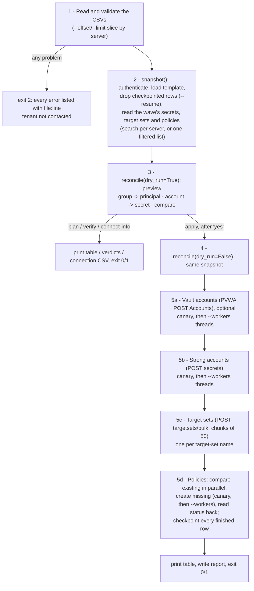
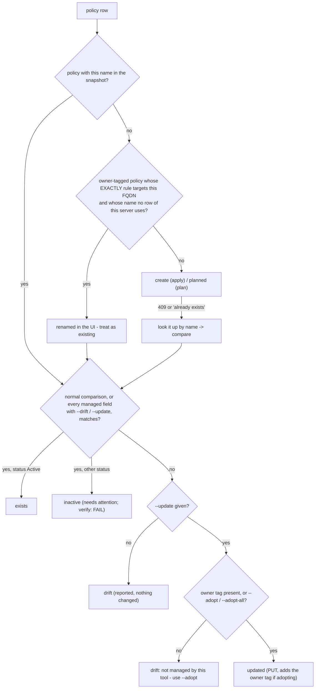

# Developer guide — sia-policy-automation

This document is for people who maintain or extend the tool. Operators should read the [README](../README.md) and the [operations guide](OPERATIONS.md).

## Contents

1. [Architecture](#1-architecture)
2. [Run flow](#2-run-flow)
3. [Decision logic](#3-decision-logic)
4. [Scale mechanisms](#4-scale-mechanisms)
5. [Safety mechanisms](#5-safety-mechanisms)
6. [Configuration internals](#6-configuration-internals)
7. [API calls and payloads](#7-api-calls-and-payloads)
8. [The consuming side](#8-the-consuming-side)
9. [Tests and development workflow](#9-tests-and-development-workflow)
10. [Extending the tool](#10-extending-the-tool)
11. [References](#11-references)

## 1. Architecture

Python 3.11+ with `requests`, `tomlkit`, `tzdata`, `prompt-toolkit` and `rich`. The tenant is the source of truth and the CSVs are
the desired state; local state is configuration, optional credentials/reports, and a resumable checkpoint with no
secrets. Units of
work: one strong account per referenced account, one target set per distinct *target-set name*, one access policy
per `servers.csv` row (a server may have several rows). The target-set name is normally the server's FQDN, but
with `target_set_scope = "auto"/"domain"` a server that takes its strong account from `domains.csv` uses a single
`Domain` set covering its whole AD domain, so one set can serve thousands of servers. Linux rows
(`protocol=ssh`) reconcile only the policy, because SIA's Linux ZSP uses a short-lived SSH certificate.



| Module | Responsibility |
|---|---|
| `sia_onboard.py` / `sia/bootstrap.py` | Installable `sia` entry point and CLI (`argparse`): wires config, session-scoped credentials, clients and reconciliation; routes terminal/offline commands before tenant authentication; emits valid structured failures for `--json`. The script entry point remains compatible. |
| `sia/config.py` | Strictly parses and validates typed TOML, IANA time zones, templates, URLs and ranges; resolves TOML file paths beside the config; reads `.env` without mutation (`read_dotenv`) while retaining `load_dotenv` compatibility; loads password CSVs. |
| `sia/settings.py` / `sia/terminal.py` | Complete typed setting registry, comment-preserving TOML editor, grouped/searchable settings, readable change review, atomic saves with external-edit protection, safe `.env` updates, and guided home/setup/workflows. |
| `sia/console.py` / `sia/starter.py` | Live command/value/path completion, memory-only allowlisted command history, wrapping terminal presentation with plain fallback; bundled non-secret config template created exclusively when missing. |
| `sia/diagnostics.py` / `sia/doctor.py` / `sia/help.py` | Stable redacted diagnostic codes and `What happened / What changed / What to do next` rendering; independent offline/online checks; searchable built-in operator guidance. |
| `sia/runtime.py` | Per-terminal-session credential overlay, non-secret config drafts keyed by resolved path, and temporary process-environment bridge. Exported values take precedence; file values are not permanently copied into the process. |
| `sia/inputs.py` | Reads the CSVs into frozen dataclasses (`ServerRow`, `StrongAccountRow`, `GroupRow`, `DomainRow`); reports every problem with `file:line`; allows several rows per FQDN (they must agree on strong account, domain, protocol, target set) and rejects duplicate effective policy names before any tenant contact (`effective_policy_name`); resolves each row's group (`_resolve_groups`), strong account (`_resolve_strong_account`) and target set (`_resolve_target_set`); renders templated accounts of type `existing`/`vault`/`credentials`; `Inputs.unique_fqdns`, `rows_for`, `target_rows`, `window()` (waves). `_build_server_row` is shared by `load_inputs` (servers.csv) and `inline_inputs` (`--server`), so the two paths cannot validate differently. |
| `sia/auth.py` | `PlatformTokenProvider` (documented client-credentials flow) and `ServiceUserOIDCTokenProvider` (the SDKs' `Oauth2/Token` + `OAuth2/Authorize` flow). Both cache until a minute before expiry, refresh on demand, and register every secret with the redactor. |
| `sia/http.py` | One `requests.Session`; bearer header; the retry policy in [§5](#5-safety-mechanisms); `RateLimiter` (token bucket + shared 429 penalty); `SIAApiError` with redacted body, `status` (0 for network errors), `client_error`, `not_found`, `uncertain`. |
| `sia/clients.py` | 1:1 endpoint wrappers. `SIAClient.probe()` detects the strong-account and target-set path families (`SIACapabilities`), listings paginate and accept name / strong-account filters, `find_secret()`; `UAPClient` lists (`filter`, `q`, `nextToken`), `owned_vm_filter()`, `find_policies_for_fqdn()`; `IdentityClient`. No business logic. |
| `sia/pvwa.py` | `PVWAClient`: logon (CyberArk/LDAP), `find_account`, `add_account`, logoff — reuses `HttpClient` with the PVWA token sent verbatim. |
| `sia/resolve.py` | `PrincipalResolver` (Identity group → UAP principal, with directory pinning and ambiguity errors), `SecretIndex` (deterministic secret lookup), `pick()` (snake/camel-tolerant key access). |
| `sia/payloads.py` | Pure functions: every request body (SIA secret, target set, UAP policy, PVWA account), template validation/sanitising, full managed-field signatures, `policy_status`, rename detection and ownership. `metadata.status` uses `[defaults] policy_status` on create; updates preserve the live value unless an explicit status action is requested. |
| `sia/reconcile.py` | The engine: `snapshot()` reads the tenant once with the chosen lookup strategy; `reconcile()` decides and applies in dependency order (vault → secrets → target sets → policies), enforces ownership, fail-fast, uncertain-write handling, bounded drift reads, conflict reclassification, checkpointing and progress. `workers` parallelises reads, creations and existing-policy comparisons through `_execute()` — the first item of each creating stage always runs alone (canary). |
| `sia/checkpoint.py` | Version-2 append-only JSON-lines checkpoint; validates complete stage status/reference records and fingerprints the tenant, effective settings, template, account mapping and row inputs before resume. |
| `sia/connect.py` | The consuming side: gateway host, portal URL, login suffix, `zsp_username()`, `rdp_file_text()`, CSV/`.rdp` writers (`connect-info`). |
| `sia/report.py` | Console summary and diagnostics, collision-resistant atomic JSON/CSV reports, explicit report-write failures after tenant work, exit codes, and verify verdicts. |
| `sia/artifacts.py` | Stages all output bytes before publication, preserves existing file modes, publishes generated names exclusively, and reports intended/completed paths on partial output failure. |
| `sia/redact.py` | Registry of secrets bucketed by length; `redact()` (cost independent of the number of secrets); `RedactingFilter` for logging. |

## 2. Run flow



Details worth knowing:

- `snapshot()` runs once per command; `apply` without `--yes` previews and applies from the same snapshot (no
  second tenant read). A create that then hits a name conflict is reclassified (§3), so a stale preview is safe.
- Policy creation reads the policy back `status_polls` times (default 5; `[http] status_polls`), 2 s apart while the
  status is `Validating`. A failed read-back, missing ID, malformed response, or status that never proves the
  requested final state is `unverified`; it is not counted or checkpointed as success. `Error` is a failure.
- Group resolution stays single-threaded (the resolver cache is not thread-safe and groups are few); reads,
  creates and existing-policy comparisons fan out on a `ThreadPoolExecutor`.
- `--only <stage>` disables writes for the other stages; lookups and comparisons still run for everything.
- A row is written to the checkpoint only after every stage has a complete good status and required object reference
  (apply only). `uncertain`, `unverified`, malformed and incomplete outcomes are reconciled again.

## 3. Decision logic

### Rows and units

`_plan_rows()` builds one `ServerResult` per `servers.csv` row, keyed `(fqdn, policy_name)`; rows whose checkpoint
record matches their fingerprint and is complete are set aside as *resumed* (their outcomes come from the record
and no lookup is issued for them). `_ensure_target_sets()` then runs two passes: the strong-account outcome is set
per row, and `_rows_by_target_set()` groups the active Windows rows by `ServerRow.target_set_key` so each target
set is reconciled once and its outcome copied to every row that uses it — which for a `Domain` set spans several
FQDNs. `report._counts()` de-duplicates on the same key, so a shared set counts as one object, not one per server.

### Linux rows

`protocol=ssh` rows skip the vault, secret and target-set stages: `secret` and `target_set` are `n/a` (not counted
as failures) and the policy is built with `behavior.connectAs.ssh.username` (row `ssh_username`, else
`defaults.ssh_username`).

### Vault account (`_ensure_vault`, optional)

Runs only when a `PVWAClient` is given (`[pvwa] base_url` set) and only for referenced `type=vault` accounts.

| Situation | Status |
|---|---|
| `find_account(safe, name)` finds it | `exists` |
| Missing, `--only` excludes the stage | `skipped` |
| Missing, no `username` on the account | `failed` |
| Missing, password from the password file (or env/prompt), apply | `created` via `POST /PasswordVault/API/Accounts` |
| Missing, plan | `planned` (with or without a password) |
| Missing, no password, apply | `failed` → the SIA secret is `blocked`, the row's target set and policies too |

The address is the account's `address` column, else the AD domain for domain accounts, else the FQDN of the
first server using the account.

### Group, strong account and target set of a row (`inputs.py`)

Resolved at parse time, before any tenant contact:

| | Order |
|---|---|
| group | the `group` cell → the domain's `group_template` (domains.csv) → `[defaults] group_template` → error |
| strong account | the `strong_account` cell → the domain's `strong_account` (domain-joined rows only) → `[defaults] strong_account_template` → error |
| target set | `scope = server`: the FQDN, type `Target`. `scope = auto`/`domain`: the domain's `target_set` (default: the domain name) and `target_set_type`, but only for a row that took its account from domains.csv; otherwise the FQDN. `scope = domain` additionally rejects a domain-joined row whose domain has no domains.csv entry. |

A strong account named only in domains.csv is materialised as a `type=existing` `StrongAccountRow` with
`account_domain` set to the domain — the tool looks it up and never creates it, which is what "onboarded by hand"
means operationally. An explicit `strong_accounts.csv` row of the same name wins.
`_check_shared_target_sets()` rejects two domains that point at one target set with different strong accounts,
which is what lets the reconciler assume every row in a target-set group shares an account.

### Strong account (`_ensure_secrets`)

| Situation | Status |
|---|---|
| Secret found by `sia_name` (case-insensitive) | `exists` (warn if SIA type ≠ CSV type or inactive; SIA's type wins) |
| Vault stage failed for this account | `blocked` |
| Not found, `type=existing` | `failed` |
| Not found, `vault`/`credentials`, apply | `created` |
| Not found, plan | `planned` (credentials without a password: `planned` with a note) |
| `credentials` without a password, apply | `failed` (password order: env var → password file → interactive prompt, at most five prompts) |

### Target set (`_ensure_target_sets` / `_reconcile_existing_target_set`)

One per target-set name; the outcome is copied to every row that uses it. For a `Domain` set that means every
server in the AD domain, so `--update` on one re-points all of them — the drift/planned detail says so, and
`--adopt` accepts the target-set name as well as an FQDN or policy name.

| Situation | Status |
|---|---|
| Strong account unavailable | `blocked` |
| Not found | `created` via bulk (207 per-item) / `planned` |
| Found, same `secret_id` | `exists` (+ *unmanaged* note if no `managed-by:` marker) |
| Found, other `secret_id`, no `--update` | `drift` |
| Found, other `secret_id`, `--update`, owned or adopted | `updated` (`PUT …/targetsets/{name}`) |
| Found, other `secret_id`, `--update`, neither | `drift` with `--adopt` hint |

### Policy (`_ensure_policies` / `_reconcile_existing_policy`)



`policy_signature()` normalises every policy field the tool writes: name/description, time frame, entitlement,
sorted tags, time zone, principal IDs/types/source-directory metadata, delegation classification, conditions,
FQDN rules, and complete RDP/SSH behavior (including local groups and reconnect). A top-level key missing from a
partial list object is `None`; `--drift` / `--update` fetches the full object before using the complete signature.
Names are compared HTML-unescaped. Status is handled separately: normal updates preserve the live value;
`--set-policy-status Active|Suspended` requires `--update` and deliberately includes it in preview/update behavior.

`target_set_signature()` compares the account ID/type, target-set type, description, certificate validation and
provisioning format during full drift checks. Without `--drift`, the account link remains the lightweight check.

### Template policy

`validate_template()` requires `policyEntitlement.targetCategory == "VM"`, `locationType == "FQDN/IP"`, at least one
connection profile (RDP `localEphemeralUser`/`domainEphemeralUser`, or SSH `username`) and non-empty conditions.
`sanitize_template()` keeps only `conditions` ∩ {accessWindow, maxSessionDuration, idleTime, accessApproval},
`behavior.connectAs.rdp` ∩ the two profile keys, `behavior.connectAs.ssh.username`, `metadata.timeZone`,
`metadata.policyTags`, `delegationClassification`. `build_policy()` then uses the profile matching the row's
protocol and fails the row if the template lacks it; a per-row `assign_groups` (rdp) or `ssh_username` (ssh)
still overrides the cloned value.

## 4. Scale mechanisms

**Lookup strategies (`snapshot()`).** `--lookup search` reads per server, in parallel: `find_secret(sia_name)` per
account, `list_target_sets(name=fqdn)` per server (or per strong account when the tenant requires
`strongAccountId`), and `find_policies_for_fqdn(q)` for every FQDN plus every custom policy name that does not
contain its FQDN. `--lookup list` reads one listing each: all secrets (paginated), all target sets (or per
referenced strong account), and the policies carrying the owner tag (`filter=(targetCategory eq 'VM') and
(policyTags eq '<tag>')`; the plain VM listing only with `--adopt-all`). `auto` picks search up to
`[http] lookup_search_max_rows` servers (default 2,000), list above, list with `--adopt-all`.

**Bounded drift reads.** The list endpoint returns partial policies. `_reconcile_existing_policy()` compares what
the object carries and fetches the full policy (`GET /api/policies/{id}`) only when `drift` is requested
(`--drift`, implied by `--update`), when the object lacks `principals`, or for a rename candidate. Rename detection
(`_build_owned_index()`) indexes owner-tagged policies by their `EXACTLY` FQDN rules; objects without targets are
fetched in full only when their description mentions one of the wave's FQDNs.

**Conflict reclassification.** A create answered with 409 (or a 400 mentioning an existing/duplicate name) — e.g. a
same-name policy hidden from the owner-tag listing — is looked up by name and compared instead of failing.

**Checkpoint / resume.** Version 2 records append `{version, key, fingerprint, statuses, refs, at}` only for rows
whose exact `secret`, `target_set` and `policy` stages are complete and whose non-`n/a` stages have references.
The fingerprint covers the tenant URLs, all effective object-shaping settings, sanitized template content, account
mapping, full row input and the `update`/`drift` options the row was checked with (a row verified by a lighter
run is reconciled again by `--update`). `--resume` drops only a matching complete record before the snapshot. Older, malformed,
incomplete and mismatched records emit a warning and are reconciled. `uncertain`/`unverified` outcomes are never a
successful record. A checkpoint is a local cache of an earlier verified result, not proof of current tenant state.
`verify` and `connect-info` never use it.

**Parallelism and pacing.** `_parallel()` for reads (no canary), `_execute()` for writes (canary first, then the
pool). `RateLimiter` (token bucket at `[http] max_requests_per_second`, shared by every `HttpClient`) is acquired
before each attempt; a 429 calls `penalize(delay)` so every worker pauses. `_tick()` logs progress every
`--progress-every` objects per stage.

**Waves.** `Inputs.window(offset, limit)` slices by unique FQDN so both rows of a server stay together
(`--offset/--limit` on plan, apply, verify, connect-info).

**Reports.** `print_summary(max_rows=200)` shows noteworthy rows only for larger runs; JSON keeps per-row detail
up to `json_max_rows` (10,000) and counts beyond; the CSV always has every row. Redaction scans by secret length
so a password file with 70,000 entries does not slow down logging.

## 5. Safety mechanisms

**Retry policy (`http.py`).**

| Response | Reads: GET / HEAD / OPTIONS and explicitly marked read-only POST | Mutations: POST / PUT / PATCH / DELETE |
|---|---|---|
| 401 | refresh token once, retry | same |
| 429 | retry with backoff (honours `Retry-After`), penalises the shared limiter | same |
| 500/502/503/504 | retry with backoff, up to `max_retries` | **no retry** — raise `SIAApiError(uncertain=True)` |
| network error / timeout | retry with backoff | **no retry** — `status=0`, `uncertain=True` |
| other 4xx | raise immediately (`client_error=True`) | same |

An uncertain mutation may have been applied. The reconciler reports `uncertain`, does not retry or checkpoint it as
complete, and requires a read-only reconciliation before another mutation. A write accepted without a usable ID,
complete response or successful read-back becomes `unverified` under the same rule.

Read-only POST calls explicitly pass `mutation=False`; HTTP verb alone cannot classify Identity query endpoints.
Discovery validates response envelopes and identifiers, bounds pagination, detects repeated pages/tokens, and
rejects conflicting duplicate names. Incomplete discovery cannot be used as evidence that an object is missing.

**Cancellation and partial results.** Read and mutation pools submit at most `workers` outstanding tasks. A fatal
worker/checkpoint error or interruption sets a shared stop event, cancels queued work, and waits for in-flight
requests within the HTTP timeouts. The HTTP and PVWA mutation boundaries check the event immediately before
sending. Confirmed receipts survive later read-back/checkpoint failures; pending rows become blocked and uncertain
writes retain their state. The CLI writes the available report with `complete: false` and restores session client
callbacks after the command. Checkpoint records are flushed and fsynced before being considered durable.

**Settings recovery.** Structured validation issues carry affected section/key pairs so Setup and Settings can
route repair to the right group. Scalar/list input parsing is strict; cross-field checks run before save.
`SettingsDocument.rebase()` merges base/disk/draft values without discarding unresolved conflicts. Atomic config
and credential saves recheck the source digest immediately before replacement. Setup and Settings share only a
non-secret draft within the current home session; standalone exit and process termination discard it.

**Fail-fast (`reconcile.py`).** `_systematic(exc)` is true for a 4xx other than 404/409/429 when `fail_fast` is
on (default). The first such error from a create/update calls `_abort(reason)`: the reason is recorded in
`RunResult.aborted` and every remaining create/update in every stage becomes `blocked`. Lookups and comparisons
continue so the report is still complete. `--keep-going` sets `fail_fast=False`.

**Ownership.** `is_owned_policy()` checks `metadata.policyTags` for `owner_tag`; `is_owned_target_set()` checks
the description for `managed-by:<owner_tag>`. `--adopt` values are lower-cased and matched against the server
FQDN and the policy name; `--adopt-all` adopts everything. Adoption happens through the normal update path (the
desired payload always carries the tag/marker).

**Concurrency.** Workers check `_abort_reason` before starting and mark their item `blocked` if the canary (or any
earlier worker) aborted; in-flight requests are not cancelled, so at most `workers - 1` extra requests can follow
an abort. Shared structures (`_refs`, `_secrets`, `_policies`, the owned index, progress counters, the checkpoint
file) are updated under locks.

**Redaction.** `register_secret()` is called for the client secret, every token (SIA and PVWA), every strong-account
password (env, file or prompt). `SIAApiError` and `AuthError` redact their text; `RedactingFilter` scrubs log
records; the CLI's catch-all handler redacts unexpected exceptions and only logs the traceback at DEBUG. The
checkpoint, reports, connection CSV and `.rdp` files never contain secrets.

## 6. Configuration internals

- `load_config()` rejects unknown sections/keys and wrong TOML types (including quoted booleans), requires
  `[tenant]`, and requires the four `[defaults]` keys `days_of_week`, `from_hour`, `to_hour`,
  `target_set_cert_validation` to be present. Relative `[auth] password_file` and `[http] ca_bundle` paths resolve
  beside the config file. Command-line paths remain relative to the invocation directory.
- `validate()` checks HTTPS base URLs, IANA time zones, hour format, session/idle ranges, day values, lists,
  `provision_format` containing `<user>`,
  the `owner_tag` charset, `identity_auth`, `status_polls` 1–10, `target_set_scope`, that `[http] ca_bundle`
  exists on disk and is not combined with `verify = false`, that every name template (now including
  `group_template` and `strong_account_domain`) uses only `{hostname}`, `{fqdn}`, `{domain}` and their
  `_upper`/`_lower` variants (`description_template` may also use `{protocol}`), the
  `strong_account_type` matrix (vault needs safe + account-name templates, credentials needs a username template,
  both need `strong_account_template`), the `[http]` scale keys (`max_requests_per_second >= 0`,
  `lookup_search_max_rows >= 0`, the two path-family pins), `[pvwa]` (https URL, auth type, platform) and
  `[connect]` (bare host, suffix without `@`).
- Defaults changed for this programme: `policy_name_template = "{fqdn}"`, `max_session_hours = 2`.
- `read_dotenv()` is non-mutating, rejects duplicate keys/malformed quoting, and returns file values for explicit
  source resolution. `load_dotenv()` retains compatibility without overriding exported variables. The terminal
  keeps a session overlay, and `settings.update_dotenv()` preserves unrelated lines/comments, atomically writes
  safely quoted values, rejects external-edit races, and applies mode 0600 on POSIX.
- `settings.SETTING_DESCRIPTORS` covers every dataclass field. `open_settings()` can open syntactically valid but
  semantically invalid TOML for repair; save validates, previews a diff, detects outside edits and atomically
  replaces the file while preserving TOML comments.
- URLs: `https://{subdomain}.dpa.{root_domain}`, `https://{subdomain}.uap.{root_domain}`, portal
  `https://{subdomain}.{root_domain}`; `identity_url` is used verbatim.

## 7. API calls and payloads

Wire formats come from the documented APIs (Access Control Policies API, SIA strong-account and target-set
APIs, PVWA REST API) and CyberArk's official SDKs, and are pinned by `tests/test_payloads.py` and
`tests/test_http_auth_clients.py`. SIA (`dpa`) APIs use snake_case JSON; UAP uses camelCase; Identity uses
PascalCase; PVWA uses camelCase.

| Purpose | Call |
|---|---|
| Platform token | `POST {identity_url}/oauth2/platformtoken` — form `grant_type=client_credentials&client_id=…&client_secret=…` |
| Service-user OIDC token | `POST {identity_url}/Oauth2/Token/<app>` (Basic auth, `grant_type=client_credentials&scope=api`) then `GET {identity_url}/OAuth2/Authorize/<app>?client_id=<app>&response_type=id_token&scope=openid profile api&redirect_uri=https://cyberark.cloud/redirect` (no redirects) → 302 whose `Location` fragment carries `id_token` |
| Tenant settings | `GET https://<sub>.dpa.cyberark.cloud/api/settings` → `self_hosted_pam.{tenant_type, pvwa_base_url, connector_pool_id, service_user_secret_id}` |
| Probe | `GET /api/secrets/public/v1?secret_type=…&count=1` (200 → `public`, 404/405 → `legacy`); `GET /api/targetsets` (200 → legacy, 400 mentioning strongAccountId → legacy + per-account listing, 404 → try `/api/discovery/targetsets`). Pinned families skip the probe. |
| Strong accounts (public) | `GET /api/secrets/public/v2?secret_type=…[&secret_name=…][&b64StartKey=…]` → `{secrets, b64_last_evaluated_key}`, falling back to `GET /api/secrets/public/v1?…&count=500&offset=N`; `POST /api/secrets/public/v1` (201; 404 → legacy path once) |
| Strong accounts (legacy) | `GET /api/secrets?secret_type=ProvisionerUser,PCloudAccount` · `POST /api/secrets` |
| Target sets | `GET /api/[discovery/]targetsets[?strongAccountId=…][&name=…][&b64StartKey=…]` → `{target_sets, b64_last_evaluated_key}` · `POST …/targetsets/bulk` (207, `results[].{target_set_name, success}`) · `PUT …/targetsets/{name}` |
| Policies | `GET https://<sub>.uap.cyberark.cloud/api/policies?limit=50&filter=…[&q=…][&nextToken=…]` → `{results, nextToken}` (partial objects) · `GET /api/policies/{id}` · `POST /api/policies` → `{policyId}` · `PUT /api/policies/{id}` |
| Directories | `GET {identity_url}/Core/GetDirectoryServices` · `POST {identity_url}/UserMgmt/DirectoryServiceQuery` with `{"directoryServices": [...], "group": "<json filter>", "Args": {...}}` |
| PVWA | `POST {pvwa}/PasswordVault/API/auth/{CyberArk\|LDAP}/Logon` → token (sent verbatim as `Authorization`) · `GET {pvwa}/PasswordVault/API/Accounts?search=<name>&filter=safeName eq <safe>` → `{value: [...]}` · `POST {pvwa}/PasswordVault/API/Accounts` · `POST …/auth/Logoff` |

Headers on every call: `Authorization: Bearer <token>` (PVWA: the raw token), `Accept: application/json`, `X-IDAP-NATIVE-CLIENT: true`.

**Strong account (vault reference)** — `POST /api/secrets/public/v1` (or `/api/secrets`):

```json
{
  "secret_name": "web01-Administrator_SIA-LocalAdmins",
  "secret_type": "PCloudAccount",
  "is_active": true,
  "secret": {"secret_data": {"safe": "SIA-LocalAdmins", "account_name": "web01-Administrator"}, "tenant_encrypted": false},
  "secret_details": {"account_domain": "local", "ephemeral_domain_user_data": {}}
}
```

`credentials` (the *not vaulted* strong account stored in SIA): `"secret_name": "<CSV name>"`,
`"secret_type": "ProvisionerUser"`, `"secret_data": {"username": "...", "password": "..."}`.

**Vault account** — `POST /PasswordVault/API/Accounts` (vault stage):

```json
{"name": "web01-Administrator", "address": "web01.corp.example.com", "userName": "Administrator",
 "platformId": "WinServerLocal", "safeName": "SIA-LocalAdmins", "secretType": "password", "secret": "<current password>",
 "secretManagement": {"automaticManagementEnabled": true}}
```

**Target sets** — `POST …/targetsets/bulk`. `type` is `Target` (one machine), `Domain` (every machine in an AD
domain) or `Suffix` (every machine under a DNS suffix); `ArkSIATargetSetType` in `ark-sdk-python` is the reference.

```json
{"target_sets_mapping": [{"strong_account_id": "<secret_id>", "target_sets": [
  {"name": "web01.corp.example.com", "type": "Target", "secret_type": "PCloudAccount", "secret_id": "<secret_id>",
   "description": "RDP ZSP target web01.corp.example.com via ADM-web01 [managed-by:sia-policy-automation]",
   "enable_certificate_validation": false}
]}]}
```

One `Domain` set for a whole AD domain, sharing that domain's strong account. Note the description names the
scope, not a server: `server.description` is a per-server column and would be wrong on a shared object.

```json
{"target_sets_mapping": [{"strong_account_id": "<corp secret_id>", "target_sets": [
  {"name": "corp.example.com", "type": "Domain", "secret_type": "PCloudAccount", "secret_id": "<corp secret_id>",
   "description": "RDP ZSP domain corp.example.com via SA-CORP-SIA [managed-by:sia-policy-automation]",
   "enable_certificate_validation": false}
]}]}
```

`PUT …/targetsets/{name}` re-sends `enable_certificate_validation` and `provision_format` as well: the PUT
replaces the object, so omitting them would reset them to the platform default.

**Policy** — `POST https://<sub>.uap.cyberark.cloud/api/policies`:

```json
{
  "metadata": {
    "name": "web01.corp.example.com",
    "description": "Automated: RDP ZSP access to web01.corp.example.com",
    "timeFrame": {},
    "policyEntitlement": {"targetCategory": "VM", "locationType": "FQDN/IP", "policyType": "Recurring"},
    "policyTags": ["automated", "sia-policy-automation"],
    "timeZone": "America/New_York",
    "status": {"status": "Active"}
  },
  "principals": [{"id": "<InternalName>", "name": "SIA-Web-Admins", "type": "GROUP",
                  "sourceDirectoryId": "<DirectoryServiceUuid>", "sourceDirectoryName": "CyberArk Cloud Directory"}],
  "delegationClassification": "Unrestricted",
  "conditions": {"accessWindow": {"daysOfTheWeek": [1, 2, 3, 4, 5], "fromHour": "07:00", "toHour": "19:00"},
                 "maxSessionDuration": 2, "idleTime": 10},
  "targets": {"FQDN/IP": {"fqdnRules": [{"operator": "EXACTLY", "computernamePattern": "web01.corp.example.com",
                                          "domain": "corp.example.com"}]}},
  "behavior": {"connectAs": {"rdp": {"localEphemeralUser": {"assignGroups": ["Administrators"],
                                                            "enableEphemeralUserReconnect": false}}}}
}
```

`metadata.status` is **required** on create -- `ArkUAPMetadata.status` has no default and tenants reject a POST
without it (`Field required (field: status)`); CyberArk's own SDK example sends
`ArkUAPPolicyStatus(status=ArkUAPStatusType.ACTIVE)`. Allowed create defaults are `Active` and `Suspended`
(`[defaults] policy_status`); `Validating`/`Error`/`Warning` are assigned by the platform and reported back on
read. `build_policy_update` carries the *existing* status over so an unrelated fix cannot un-suspend a policy.
Only `--update --set-policy-status Active|Suspended` deliberately substitutes the requested status, and the same
option is available on `plan` for preview.
**Linux policy** — identical except for the
behaviour block and no target set / strong account: `"behavior": {"connectAs": {"ssh": {"username": "ec2-user"}}}`.

Conventions confirmed per tenant with `show-policy` (and `--from-list`) before bulk runs: the FQDN-rule encoding
(full FQDN in `computernamePattern` + DNS domain in `domain`), the principal's `sourceDirectoryName`/`sourceDirectoryId`
values, and which fields the list endpoint carries.

## 8. The consuming side

`sia/connect.py` is pure and secret-free. `connect-info` combines it with a dry-run snapshot (unless
`--no-tenant`) to produce, per row: `fqdn, hostname, policy_name, groups, protocol, strong_account, secret_status,
target_set_status, policy_status, policy_id, portal_url, gateway_host, rdp_username, rdp_file`.

- `gateway_host(cfg)` = `[connect] gateway_host` or `<subdomain>.rdp.<root_domain>`; `portal_url(cfg)` =
  `https://<subdomain>.<root_domain>/dpa`; `login_suffix(cfg, client_id)` = `[connect] login_suffix`, else the part
  after `@` in `SIA_CLIENT_ID`, else `<subdomain>.<root_domain>`.
- `zsp_username(user, suffix, subdomain, fqdn, domain_joined, network)` →
  `secureaccess /i <user>@<suffix> /s <subdomain> /a <fqdn>[ /d local][ /n <network>]` (the documented RDP-client
  format for zero-standing-privileges access).
- `rdp_file_text()` writes `full address`, `gatewayhostname`, `gatewayusagemethod:i:1`, `gatewaycredentialssource:i:5`,
  `gatewayprofileusagemethod:i:1`, `gatewayaccesstoken:s:secureaccess`, `username`, `prompt for credentials:i:1`
  with CRLF line endings — the same gateway parameters the portal puts into its generated files, minus the
  single-use token.
- `verify` maps outcomes to verdicts (`report.verdict_for`): created/exists/updated/n/a → PASS, planned → MISSING,
  drift/failed/blocked/inactive → FAIL, skipped → SKIP; exit 1 when anything is not PASS.

## 9. Tests and development workflow

```bash
python -m pip install -r requirements-dev.txt
python -m pytest                 # fully offline
```

- `tests/fakes.py`: an in-memory tenant (`FakeSIA` with `capabilities`, name/account filters; `FakeUAP` honouring the
  tag filter, `partial_list`, 409 on duplicate names; `FakeIdentity`; `FakePVWA`) with hooks to inject failures, and a
  scripted `requests.Session` (`FakeSession`, `FakeResponse`).
- `tests/test_payloads.py`: golden request bodies (SIA, UAP, PVWA), template validation, signatures on partial objects.
- `tests/test_resolve_reconcile.py`: the decision matrix — create/exists/drift/blocked/inactive, both lookup modes,
  two policies per server, snapshot-once preview + apply, checkpoint/resume with edited rows, progress, per-account
  target-set listing, conflict reclassification, bounded drift reads, rename detection with claimed names,
  fail-fast vs `--keep-going`, uncertain 5xx, ownership and adoption, the vault stage, template cloning, SSH rows,
  `--workers` with the canary, `--only`.
- `tests/test_http_auth_clients.py`: both auth adapters, the retry policy, the rate limiter, redaction, the SIA
  probe and both path families, secrets v2/v1 pagination, per-account target sets, UAP filters, PVWA calls.
- `tests/test_inputs.py` / `tests/test_config.py` / `tests/test_settings.py`: strict types and semantic validation,
  malformed CSV/TOML/.env cases, source/path precedence, templated accounts, comment-preserving atomic edits and
  external-edit protection.
- `tests/test_connect.py`, `tests/test_report_redact.py`: the consuming side, report caps, verify verdicts, the
  checkpoint file, redaction at 50k secrets.
- `tests/test_terminal.py`: settings display/edit/setup, session versus `.env` credentials, secret non-disclosure,
  Back/Cancel/EOF/Ctrl-C at each setup stage, session drafts, safe URL corrections, external-edit merge and conflict
  recovery, credential reprompts, editable workflow review, and POSIX/Windows command parsing.
- `tests/test_client_response_safety.py`: malformed read/write envelopes, pagination loops and limits, duplicate
  identities, conservative mutation retries and cancellation immediately before sending.
- `tests/test_execution_recovery.py`: controlled concurrent checkpoint failure, bounded scheduling, interruption,
  partial results, and ambiguous discovery before writes.
- `tests/test_artifact_recovery.py`: staging and partial publication failures, generated-name races, portable RDP
  names, collisions between rows, and preservation of existing outputs.
- `tests/test_console.py`, `tests/test_starter.py`, `tests/test_shell_dispatch.py`: completion and history boundaries,
  narrow/plain rendering, starter-file preservation and concurrent creation, and help/parser recovery in the shell.
- `tests/test_cli.py`: the real CLI against the fake tenant (legacy and new commands, structured/JSON failures,
  prompts, exit codes, resume, waves, the vault stage, redacted unexpected errors). CLI tests pass `--checkpoint`
  so nothing is written into `input/`.
- `tests/conftest.py` resets the redaction registry between tests.
- `tests/test_windows_install.py`: interpreter/runtime selection, pip repair, source fingerprints, failed-candidate
  cleanup, pointer publication, and preservation of user files. Subprocess boundaries are injected for offline tests.
- `tests/test_windows_launchers.py`: native Windows CMD fallback, launch, and automatic repair with a stub backend;
  skipped on other platforms. `tests/test_windows_security.py` exercises credential-protection failure paths and
  performs a native DACL round trip on Windows.

Windows installation starts at `install.cmd`, which prefers `install.ps1` and can invoke
`scripts/windows_install.py` directly when PowerShell cannot run the script. The backend uses immutable environment
directories and atomically publishes `.sia-python.path` only after validation. `Start-SIA.cmd` runs the backend's
`--check` before launch and attempts repair once if needed. Avoid moving virtual environments, using activation as
a prerequisite, or treating successful package installation alone as successful startup.

`.github/workflows/ci.yml` lints and runs the suite on Ubuntu, exercises the documented macOS/Linux install path,
and runs the suite plus real install/reinstall/launcher checks on native Windows with
PowerShell 5.1/Python 3.11 and PowerShell 7/Python 3.14. It uses temporary source copies and makes no tenant calls.
Local macOS runs skip Windows-only checks; a newly added workflow still needs a successful hosted run.
`tests/windows_installer_smoke.ps1` exercises actual installer functions with offline mocks for downloads,
signatures, process launches, WinGet, and Python discovery; it requires no Pester installation.

`sia/windows_security.py` owns Win32 descriptor allocation and freeing, secure temporary-file creation, DACL changes,
and inspection. `WindowsCredentialProtectionError.published` distinguishes a pre-save failure from a replaced
destination whose final ACL could not be confirmed. Terminal messages must preserve that distinction.

Code must stay Python 3.11-compatible (no 3.12-only f-string nesting, no PEP 695 syntax).

## 10. Extending the tool

| Change | Where |
|---|---|
| New policy field or behaviour (e.g. domain ephemeral user) | `payloads.build_policy` (+ golden test), possibly a new `servers.csv` column in `inputs.py` |
| Another way to derive a row's group / account / target set | `inputs._resolve_groups` / `_resolve_strong_account` / `_resolve_target_set` — one function each, called from `_build_server_row` |
| A new name-template placeholder | three places in step: `config.TEMPLATE_PLACEHOLDERS`, `inputs._render_name`, `payloads.render` |
| Credentials from a secret store instead of `.env` | a `sia/ccp.py` sibling of `sia/pvwa.py`, called from `sia_onboard.resolve_client_secret` |
| New strong-account option (e.g. ephemeral domain user settings) | `payloads.build_secret_payload` `secret_details`, `inputs.StrongAccountRow`, `config.StrongAccountTemplate` |
| Another Vault (Privilege Cloud accounts API) for the vault stage | a sibling of `pvwa.PVWAClient` with the same three methods; `reconcile._ensure_vault` is client-agnostic |
| New API call or path family | `clients.py` (thin wrapper, `SIACapabilities`) + a fake method in `tests/fakes.py` |
| New decision / status | `reconcile.py` + a case in `tests/test_resolve_reconcile.py`; add the status to `report.VERDICT_BY_STATUS` |
| New configuration key | Section dataclass + `validate()`, the `settings` descriptor/help registry, `config.example.toml`, tests and operator docs |
| New connection-string flag | `connect.zsp_username` (+ `tests/test_connect.py`) |
| Deleting objects | deliberately absent; if added, gate it behind ownership and an explicit flag |

## 11. References

- Access Control Policies API (UAP): <https://api-docs.cyberark.com/uap-schema-api/docs/access-control-policies-api>
- SIA strong accounts API for Windows: <https://docs.cyberark.com/setup/latest/en/content/privileged-access/apis/dpa-strong-accounts-api.htm>
- SIA target sets API: <https://docs.cyberark.com/setup/latest/en/content/privileged-access/apis/dpa-target-sets.htm>
- What is a Windows strong account (ephemeral user naming, requirements): <https://docs.cyberark.com/setup/latest/en/content/privileged-access/introduction/dpa_strong-account.htm>
- Create policies for virtual machine access (session limits, reconnect): <https://docs.cyberark.com/manage/latest/en/content/uap/policies-infra-vm.htm>
- Connect to a Windows target via an RDP client (gateway, user-name format): <https://docs.cyberark.com/access/latest/en/content/privileged-access/end-user/dpa_connect-using-rdp-login-rdp-client.htm>
- Connection guidance page and generated RDP files: <https://docs.cyberark.com/access/latest/en/content/privileged-access/end-user/dpa_connect-using-rdp-login-conn-guide.htm>
- ISPSS API token authentication: <https://api-docs.cyberark.com/create-api-token/docs/create-api-token>
- CyberArk `ark-sdk-python`: <https://github.com/cyberark/ark-sdk-python>
- CyberArk `idsec-sdk-golang`: <https://github.com/cyberark/idsec-sdk-golang>
- PAM Self-Hosted ↔ SIA integration: <https://docs.cyberark.com/pam-self-hosted/latest/en/content/pasimp/integrate-with-sia.htm>
