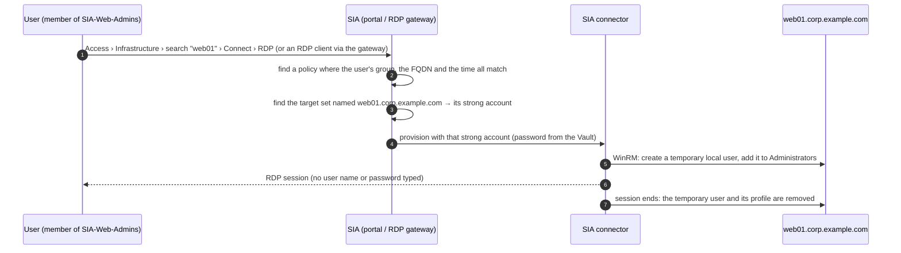

# Operations guide — sia-policy-automation

The [README](../README.md) gets you installed and running. This guide is the reference for everything after that:
what the results mean, how users connect, day-to-day changes, big rollouts, troubleshooting, questions, glossary
and the open items.

## Contents

1. [What the results mean](#1-what-the-results-mean)
2. [How a user connects](#2-how-a-user-connects)
3. [First time on a tenant](#3-first-time-on-a-tenant)
4. [Strong accounts in detail](#4-strong-accounts-in-detail)
5. [Day-to-day changes](#5-day-to-day-changes)
6. [Large rollouts](#6-large-rollouts)
7. [Safety](#7-safety)
8. [Troubleshooting](#8-troubleshooting)
9. [Questions CyberArk people ask](#9-questions-cyberark-people-ask)
10. [Glossary](#10-glossary)
11. [Open items](#11-open-items)

## 1. What the results mean

`plan` and `apply` print one line per policy row with a column for each object (strong account, target set, policy):

| Status | Meaning | What to do |
|---|---|---|
| `created` / `updated` | The tool made this object in this run. | Nothing. |
| `exists` | Already there and correct. | Nothing. (*unmanaged* = made by hand, see section 5. *add --drift to compare targets* = only name and principals were checked, see section 6.) |
| `planned` | Dry run: this is what `apply` would do. | Run `apply` when you are happy. |
| `n/a` | Not needed for this row (Linux rows have no strong account or target set). | Nothing. |
| `inactive` | The policy exists and matches, but its status is *Suspended*, *Expired* or *Error*. | Check the policy in the portal; `verify` reports it as `FAIL`. |
| `drift` | The object exists but differs from your list; the detail says how. | Decide who is right. To enforce the list: `apply --update` (section 5). |
| `blocked` | Not attempted because something it depends on failed, or the run stopped after an error. | Fix the cause in the detail and run again. |
| `failed` | SIA, Identity or the PVWA rejected it, or a name could not be found. | See [Troubleshooting](#8-troubleshooting). |
| `skipped` | You limited the run with `--only`. | Nothing. |

`verify` turns these into verdicts: `PASS` (exists / created / n/a), `MISSING` (would be created), `FAIL` (drift,
failed, blocked, inactive), `SKIP`.

Every run writes two reports to `reports/` (`plan-…` or `apply-…` with a UTC timestamp): JSON and CSV, one row per
policy row with all statuses and details. They contain no passwords and are safe to attach to a change ticket.
Exit codes: `0` all fine, `1` something needs attention, `2` a file or setting is wrong, `130` interrupted (the
checkpoint keeps what was finished).

## 2. How a user connects

The tool is not in this path; it only sets up the objects the path relies on.



**From the portal.** Sign in to `https://<subdomain>.cyberark.cloud`, open **Access › Infrastructure**, search
the server by name, click **Connect › Connect via RDP** (downloads a single-use `.rdp` file) or **Connect via
browser**. ZSP servers that are not listed yet are added once with **Add target** (address = FQDN, plus the
domain). Users pick the *server*; the policy named after it applies.

**From an RDP client** (mstsc, Connection Manager, Royal TS…). `connect-info` exports these per server and can
write ready-made `.rdp` files:

| Field | Value |
|---|---|
| Computer / remote address | the server FQDN |
| RD Gateway server | `<subdomain>.rdp.cyberark.cloud` (always use the gateway) |
| RD Gateway user name / access token | `secureaccess@cyberark` / `secureaccess` (not secrets) |
| User name | `secureaccess /i alice@acme.cyberark.cloud /s acme /a web01.corp.example.com` |

`/i` is the login name, `/s` the tenant subdomain, `/a` the target. A server that is not domain-joined needs
` /d local` (set `domain_joined = no` on its row); a connector network can be added with ` /n <network>`.
Authentication happens through Identity (MFA included). The *Connection guidance* page at
`https://<subdomain>.cyberark.cloud/dpa` generates the same thing as a single-use `.rdp` file.

**On the server.** SIA logs on with the strong account over WinRM and creates a temporary local user named after
the connecting user: the first 7 characters of the login plus a random string, 20 characters in total
(`alice.s` → `alice.sXk3f9Qm2dLp7bR`), member of the policy's local groups (`Administrators` by default). The
session ends at `max_session_hours` (2) or after `idle_minutes` (10) without activity, with a 30-second warning,
or when the policy's access window closes. Then the user and its profile are deleted. With
`enable_reconnect = false` (default) every connection gets a fresh temporary user. RDP to domain controllers is
not supported by SIA; keep DCs out of the list.

## 3. First time on a tenant

SIA tenants can encode a few details differently, so check the tool's assumptions against a real policy once:

1. Run `python sia_onboard.py preflight`. Note the **SIA API** line and pin the two path families in `config.toml`
   (`[http] secrets_api` / `targetsets_api`) so later runs do not have to detect them.
2. In the portal, create **one** ZSP policy for **one** server by hand, the way you want the generated ones to look.
3. Run `python sia_onboard.py show-policy "<its name>"` and `show-policy "<its name>" --from-list`. In the first
   JSON, `targets.fqdnRules` should be `{"operator": "EXACTLY", "computernamePattern": "<fqdn>", "domain": "<dns domain>"}`
   and the principal's `sourceDirectoryName` / `sourceDirectoryId` should match a directory `preflight` listed.
   The second output shows what the list endpoint returns (a partial object); whether it carries `principals`
   decides how cheap re-runs are (section 6). Send both to the maintainer if anything looks different.
4. `plan` and `apply` with a one-server CSV, test the RDP login as a group member (watch the temporary user
   appear in *Computer Management › Users* and disappear after logoff), run `verify`, run `apply` again
   (everything must say `exists`).

**Tip:** `template_policy = "<its name>"` in `config.toml` makes every generated policy copy that policy's access
window, session settings and connection profile, so you maintain those in one place.

## 4. Strong accounts in detail

**Per-server local admins (the default).** With the `strong_account_*` settings in `config.toml`, a row that leaves
`strong_account` empty gets the account `ADM-<hostname>`: a reference to the Vault account
`<hostname>-Administrator` in Safe `SIA-LocalAdmins`, Windows user `Administrator`, shown in SIA as
`<hostname>-Administrator_SIA-LocalAdmins`. `{hostname}`, `{fqdn}` and `{domain}` work in every template.
`strong_account_type` can also be `existing` (references already created in the SIA portal, only looked up) or
`credentials` (user name + password stored in SIA instead of the Vault; passwords from the password file).

**Accounts you name explicitly** go in `strong_accounts.csv` and are referenced from the `strong_account` column:

```csv
name,type,safe,account_name,username,account_domain,password_env,address
SA-dmz-localadmin,credentials,,,siaprov,local,SIA_SA_DMZ_LOCALADMIN_PASSWORD,
SA-corp-domain,vault,SIA-StrongAccounts,svc_sia_rdp,svc_sia_rdp,corp.example.com,,corp.example.com
SA-legacy,existing,,,,,,
```

| Column | Fill in |
|---|---|
| `name` | The label `servers.csv` refers to. |
| `type` | `vault` (a Vault account: give `safe` + `account_name`), `credentials` (stored in SIA: give `username`), `existing` (already in SIA under this name). |
| `safe`, `account_name` | For `vault`; SIA shows the reference as `<account_name>_<safe>`. |
| `username` | The Windows user name (`credentials`: required; `vault`: needed to onboard into the Vault). |
| `account_domain` | `local` (default) or the AD domain of a domain account shared by several servers. |
| `password_env` | `credentials`: env var holding the password (default `SIA_SA_<NAME>_PASSWORD`). |
| `address` | Vault onboarding of a domain account: the domain. Local accounts use the server FQDN. |

**Passwords** (for `credentials` accounts and for accounts the `vault` stage onboards) come from, in order: the
environment variable, the password file (`name,password`, kept outside the repository, `--passwords FILE` or
`[auth] password_file`), or a prompt when you run `apply` interactively (at most five per run). Every password is
masked in all output.

**Onboarding into the Vault (optional `vault` stage).** Fill in `[pvwa]` in `config.toml` and put `PVWA_USER` /
`PVWA_PASSWORD` in `.env` (a PVWA user allowed to add accounts to the Safe). `plan` shows `Vault accounts: … would
onboard …` for every referenced `vault` account missing from the Safe; `apply` onboards it (name, address = the
server FQDN, user name, platform, the current password from the password file) before creating the SIA
reference. The Windows account must already exist on the server.

**Requirements on the server.** The account must be in the local *Administrators* group, marked *Account is
sensitive and cannot be delegated*, not in *Protected Users*; local accounts need `LocalAccountTokenFilterPolicy = 1`
(push it with a GPO). The SIA connector must reach the server over WinRM (TCP 5985/5986).

**Groups in two directories.** If the same group name exists in Cloud Directory and in AD, add it to
`groups.csv` with its directory (`name,directory`); everything else is found by name.

## 5. Day-to-day changes

- **Adding servers.** Add rows, `plan`, `apply`. Existing servers show `exists`, new ones `created`.
- **A second group on a server.** Add a row with the same `fqdn`, the other `group` and a `policy_suffix`
  (or a `policy_name`). The strong account and target set are shared; only a policy is added.
- **Changing a server's strong account.** Edit the row (or the template), `plan` shows `drift` on the target set,
  `apply --update` re-points it.
- **Someone changed a policy in the portal.** `plan` shows `drift` with what differs. Update your list to match,
  or `apply --update` to put the policy back. `--update` only changes objects carrying the tool's tag
  (`sia-policy-automation`). Target changes are compared only with `--drift` (implied by `--update`).
- **Taking over a hand-built object.** It shows as `exists (unmanaged)` or `drift … not managed by this tool`.
  `apply --update --adopt web01.corp.example.com` (FQDN or policy name) lets the tool manage it; `--adopt-all`
  adopts everything matching. Adopting adds the tag.
- **A policy was renamed in the portal.** Still recognised by its tag and FQDN rule: `drift … renamed`;
  `apply --update` renames it back, never duplicates it.
- **A same-name policy existed before the tool ran.** SIA refuses the duplicate name; the tool compares that
  policy instead and reports `exists (unmanaged)` or `drift`.
- **Removing a server.** The tool never deletes. Remove the objects in the portal, then the row.
- **Only part of the process.** `--only vault|secrets|targetsets|policies` limits what is written.
- **Unattended runs.** `apply --yes`; keep the reports; check the exit code.
- **Service user password changed.** Update `SIA_CLIENT_SECRET` in `.env` (or let the tool prompt you).

## 6. Large rollouts

The programme this tool was built for has ~70,000 servers and up to two policies each.

- **Waves.** One `servers.csv` per wave, or slice one big file: `--offset 0 --limit 5000`, then
  `--offset 5000 --limit 5000`, … (rows of one server always travel together). Run `verify` after each wave.
- **Resume, do not restart.** `apply` records every finished row in `<input>/.sia-checkpoint.jsonl`
  (`--checkpoint FILE` to move it). After an interruption run the same command with `--resume`: finished rows
  are skipped without a single request; a row whose CSV values changed is always re-checked.
- **Lookups scale with the wave.** `--lookup search` (default up to 2,000 servers per run) reads the objects of
  the servers in the wave, one request per server in parallel; `--lookup list` (default above that) reads one
  listing each of strong accounts, target sets and the policies tagged by the tool. A tenant with 70,000
  policies is never read to onboard 500 more.
- **Cheap re-runs.** The policy list carries only part of each policy. Name and principals are compared from
  the list; a policy is read in full only with `--drift` / `--update`, so a re-run over 10,000 finished rows costs
  a few hundred requests.
- **Parallel creation.** `--workers 8` (up to 16). The first object of each stage is always created alone; if it is
  rejected nothing fans out. Target sets go in batches of 50.
- **Rate limits.** With several workers set `[http] max_requests_per_second` (start with 10): all workers share
  the budget and pause together after a `429`. Count `429` lines in a `-v` log and tune.
- **Progress.** `--progress-every N` (default 100) logs `policies: 1200/5000 done, 3m12s elapsed`.
- **Passwords at scale.** With `strong_account_type = "vault"` no password crosses the tool for the references;
  only accounts the `vault` stage onboards need their current password in the password file.
- **Reports.** The CSV always has every row; the console shows totals plus the rows needing attention once a run
  exceeds 200 rows; the JSON keeps per-row detail up to 10,000 rows.

Rough timing: with 8 workers a few policies per second; 100 servers in about a minute, 10,000 in roughly an
hour, depending on tenant rate limits. Confirm the tenant-side limits in [Open items](#11-open-items) first.

## 7. Safety

- `plan` writes nothing; `apply` shows the plan again and waits for `yes`.
- Nothing is ever deleted, in SIA or in the Vault.
- Objects are found by name, so a second run creates nothing.
- Differences are reported as `drift`; fixing them needs `--update`, and only for objects the tool created or you
  adopted.
- The first rejected create stops the run (`blocked` for the rest) unless you pass `--keep-going`.
- A request that fails mid-way is not retried blindly; the next `plan` shows whether the object exists.
- Passwords never appear in lists, logs, reports, checkpoints or `.rdp` files.

## 8. Troubleshooting

| What you see | What it means | What to do |
|---|---|---|
| `platform token request failed (HTTP 400/401)` | Sign-in failed. | Check `identity_url`; the service user must have **Is OAuth confidential client** ticked; check the password. |
| `HTTP 403` on `Secrets`, `Targets` or `Policies` in preflight | The service user is not an SIA administrator. | Add it to the `DpaAdmin` role. |
| `Settings: not verified (HTTP 403 …)` | The user may read SIA objects but not tenant settings. | Optional check; ignore or add the settings role. |
| `SIA API:  FAILED …` | Neither SIA path family answered. | Run with `-v`, send the log to the maintainer; pin `[http] secrets_api` / `targetsets_api` once known. |
| `Targets: OK (… per-account listing will be used)` | This tenant lists target sets per strong account only. | Nothing; the tool adapts. |
| `Identity: FAILED … 401/403` | Identity rejected the token for group lookups. | Switch `[auth] identity_auth` between `platform_token` and `service_user_oidc`, run `preflight` again. |
| `self_hosted_pam=incomplete` / `not configured` | The PAM Self-Hosted integration is missing pieces. | Complete it in SIA settings (PVWA URL, connector pool, service-user secret, tenant type SELF_HOSTED). |
| `PVWA: FAILED` / `PVWA_USER / PVWA_PASSWORD are not set` | The `vault` stage cannot log on. | Put the PVWA user's credentials in `.env`, or empty `[pvwa] base_url`. |
| `servers.csv:7: fqdn 'web01' is not a valid FQDN` | Input problem at line 7. | Fix the file; all problems are listed at once. |
| `policy name '…' collides with line N` | Two rows would create the same policy. | Same server: add `policy_suffix`. Same host name in two domains: use `{fqdn}` in `policy_name_template`. |
| `strong_account 'X' conflicts with line N for the same fqdn` | Two rows of one server disagree. | Rows of one server must share strong account, domain and protocol. |
| `strong_account is required (or set defaults.strong_account_template …)` | No strong account and no naming template. | Fill the column or set the `strong_account_*` settings. |
| `protocol=ssh needs ssh_username …` | A Linux row has no certificate user name. | Fill `ssh_username` on the row or in `config.toml`. |
| `strong_account 'SA-x' is not defined in strong_accounts.csv` | The row refers to an unknown account. | Add the row (`type=existing` if it already exists in SIA). |
| `no strong account named '…' in SIA (type=existing)` | Nothing in SIA has that exact name. | Check the *Strong accounts* page, or set `strong_account_type = "vault"` so the reference is created. |
| `Vault account '…' is missing and its current password is not available` | Nothing to onboard it with. | Add the account's name and password to the password file, or onboard it in PVWA. |
| `group 'X' not found in Identity` / `is ambiguous` | Name mismatch / same name in several directories. | Check the exact name (similar names are listed) / add it to `groups.csv` with its directory. |
| `password not available: …` | A `credentials` account needs a password. | Put it in `.env` or the password file, or run `apply` interactively. |
| target set `failed: bulk create …` | SIA rejected the target set. | Usually the strong account is inactive or the wrong type. |
| policy `status=Error` | SIA created the policy but flagged it. | Read the detail; compare with a hand-built policy (`show-policy`). |
| policy `inactive … status=Suspended` | Someone suspended the policy. | Activate it in the portal, or accept `verify` reporting `FAIL`. |
| `Run aborted (fail-fast): …` | The first create was rejected. | Fix the cause, `plan`, `apply` again. |
| `drift: … not managed by this tool` | `--update` on a hand-built object. | Add `--adopt <fqdn>`. |
| `… may or may not have been applied` | A request failed on the network mid-way. | Run `plan`; if the object exists it shows `exists`. |
| `interrupted … re-run apply with --resume` | You stopped the run. | Run the same command with `--resume`. |
| `… is readable by other users` | File permissions are too open. | `chmod 600 <file>` (macOS/Linux). |
| Many `429` lines in the `-v` log | The tenant is rate-limiting. | Set `[http] max_requests_per_second`, lower `--workers`. |

Add `-v` to any command for a detailed log (URLs and status codes; never passwords).

## 9. Questions CyberArk people ask

**Why doesn't the policy show which strong account it uses?** Because in SIA it doesn't: the policy decides
*who* and *where*, the target set decides *with which account*. Here there is one of each per server, joined by
the FQDN.

**Do we really need one strong account per server?** That is the design of this programme: no account is shared
between servers, so a compromised strong account reaches one server. The tool derives all of them from one naming
convention and the Vault manages their passwords. Shared domain accounts remain possible for the few servers that
need them.

**Do the local admin accounts have to be in the Vault?** No, but it is the sensible default: SIA holds only a
reference and the CPM rotates the password. `credentials` stores the password in SIA; `existing` uses references
created in the portal.

**Why is a vaulted strong account called `web01-Administrator_SIA-LocalAdmins`?** SIA generates the name
`<account>_<safe>` for Vault references and rejects custom names. The tool uses the same name so it always finds
the right one.

**Does this work with PAM Self-Hosted, not Privilege Cloud?** Yes; SIA stores the reference the same way for
both. Which Vault it talks to comes from the *PAM Self-Hosted* settings in SIA (PAM 14.4+). Onboarding missing
accounts uses the PVWA REST API of that Vault.

**Does it touch the strong accounts I already have?** No. Existing accounts are only looked up; nothing is ever
changed or deleted, in SIA or in the Vault.

**What does the user type?** Nothing from the portal (search, Connect, RDP). From an RDP client: the gateway and
the user-name string in section 2, or the `.rdp` file from `connect-info`.

**How long can a session last, and can the user come back?** `max_session_hours` (2) or `idle_minutes` (10) end
it and the temporary user is deleted. With `enable_reconnect = false` a new connection means a new temporary user.

**What about Linux servers?** `protocol = ssh` on the row (plus the certificate user name): policy only, no strong
account or target set.

**Can I run it every week?** Yes. Unchanged servers show `exists`, new rows are created, hand changes show as
`drift`. `verify` is the read-only variant for sign-off.

**Does it create domain (AD) ephemeral users?** No; Windows policies use local ephemeral users, which is what this
programme wants.

**Can I undo a run?** No automatic undo, but every report lists exactly what was created (policy, then target
set, then strong account if unused).

**Is it safe to hand to a colleague?** Yes. Nothing in the repository contains credentials; each person has their
own `config.toml`, `.env` and password file.

## 10. Glossary

| In the SIA portal | In this tool | Notes |
|---|---|---|
| Strong account | derived per server from `strong_account_*` templates, or a `strong_accounts.csv` row (a *VM secret* in the API) | `vault` (Vault reference), `credentials` (stored in SIA), `existing` (already in SIA) |
| Target set (type *Target*) | one per Windows server, named the FQDN | Links the server to its strong account |
| Access policy (Access control policies) | one per `servers.csv` row, named after the server, plus `policy_suffix` for a second one | Who / where / how / when |
| Ephemeral (temporary) local user | `assign_local_groups` / `assign_groups`; `max_session_hours`, `idle_minutes`, `enable_reconnect` | Created and removed by SIA at connection time |
| SSH certificate access (Linux ZSP) | `protocol = ssh`, `ssh_username` | Policy only |
| Principal | the `group` column | Resolved to the Identity group automatically |
| Directory | `groups.csv` `directory` | Only for ambiguous group names |
| Connector | – | Must reach Windows servers over WinRM |
| RD Gateway `<subdomain>.rdp.cyberark.cloud` | `connect-info` output | What RDP clients connect through |
| Vault account (PVWA) | the `vault` stage, `[pvwa]` | Onboarded only when missing |
| Service user (Identity) | `SIA_CLIENT_ID` / `SIA_CLIENT_SECRET` | Needs the `DpaAdmin` role |
| Tag `sia-policy-automation` | "managed by the tool" | `--update` only touches tagged objects unless you `--adopt` |
| Checkpoint | `<input>/.sia-checkpoint.jsonl` | Finished rows; `--resume` skips them |

## 11. Open items

1. **Confirm the tenant conventions** (section 3) on the lab tenant, then on production once the service user
   exists there. Also compare a portal-generated `.rdp` file with one from `connect-info --rdp-dir`.
2. **Confirm scale limits with CyberArk** before the large waves: any limit on the number of access policies
   (the programme targets 70,000–140,000), target sets and strong accounts, and the API rate limits. No published
   limit was found in the documentation.
3. **Two policies matching one user and one server**: confirm in the portal what the user sees when both apply.
4. **PVWA onboarding fields**: confirm the platform ID and any extra required properties on the real PVWA.
5. **Local-group changes as drift**: a change to `assign_groups` is not reported as drift today.
6. **Decommissioning**: the tool never deletes; a controlled "remove these servers" mode would have to be gated by
   the tool's tag.
7. **Automatic test run on GitHub** (CI).
