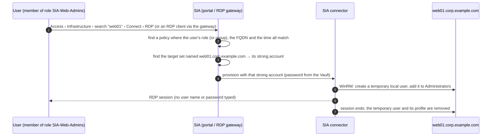

# Operations guide — sia-policy-automation

The [README](../README.md) gets you installed and running. This guide is the reference for everything after that:
what the results mean, how users connect, day-to-day changes, big rollouts, troubleshooting, questions, glossary
and the open items.

Run `sia` with no command in an interactive terminal for the home screen. It shows your setup status, a next step,
and short descriptions of Setup, Settings, Troubleshoot, Plan, Apply, Verify, Connection information and Help.
Type `/` for suggestions, use Tab to complete, arrow keys to select, and Enter to run. `/menu` shows the menu
again; `/exit` closes the program. Existing `sia COMMAND ...` and `python sia_onboard.py COMMAND ...` automation remains
available. The home screen itself, Help, Settings and offline `doctor` do not require tenant credentials.

The package includes a starter with blank tenant fields and explained defaults. The terminal home and Setup
create local `config.toml` only when the selected file is missing. Existing files are preserved; passwords belong in `.env`.
`config.example.toml` remains the full advanced reference.

`sia setup` guides you through tenant details, access defaults, and service-user sign-in. It offers explicit `.env` credential storage.
To keep credentials in memory for a home session, start `sia` and open Settings. `sia settings --show` displays
saved and effective non-secret values with their source; it reports credentials only as set/missing and their source.
Exported environment values win over session and `.env`
values. Settings controlled by `template_policy` and values overridden by a CSV row are labelled in the editor.
Relative paths stored in TOML resolve beside the TOML file; command-line paths resolve from the current directory.

Settings are grouped by tenant, access, accounts, policies, network, sign-in, connection exports and vault topics.
Type a setting name, such as `timeout`, to find it; autocomplete also matches labels. Edits remain pending until
Save. The save summary uses readable labels; choose `details` for the full TOML diff. `/back` returns one screen;
`/cancel` returns home and retains non-secret edits for this session. Reopen Setup or Settings for the same config
to resume the draft. Exiting the process discards it; no draft is stored on disk. Credential saves are separate.

Setup validates fields as you enter them. A URL correction is displayed for explicit acceptance before it is
used. The review screen exposes every settings group and shows where validation errors can be repaired. Invalid
TOML or unknown keys can be repaired externally and reloaded. If the file changes during editing, Reload preserves
unrelated edits and asks you to resolve fields changed in both places; review the merged result before Save.
Credential prompts retain the current entry when a storage choice is mistyped. An empty hidden password returns
to the service-user field without storing an incomplete credential pair.

Known home commands are kept in memory for that session only. Setting values, credential values and arbitrary
command arguments are not saved in command history. Completion falls back to plain prompts in basic terminals
(`TERM=dumb`); `NO_COLOR` turns off colors while preserving completion. Explicit command arguments such as
`/plan --server web01.example.com --principal Admins --drift` use the same parser as the standalone CLI.

## Contents

1. [What the results mean](#1-what-the-results-mean)
2. [How a user connects](#2-how-a-user-connects)
3. [First time on a tenant](#3-first-time-on-a-tenant)
4. [Strong accounts in detail](#4-strong-accounts-in-detail)
5. [Day-to-day changes](#5-day-to-day-changes)
6. [Large rollouts](#6-large-rollouts)
7. [Safety](#7-safety)
8. [Troubleshooting](#8-troubleshooting)
9. [Questions CyberArk people ask](#9-questions-cyberark-people-ask)
10. [Glossary](#10-glossary)
11. [Open items](#11-open-items)

## 1. What the results mean

`plan` and `apply` print one line per policy row with a column for each object (strong account, target set, policy):

| Status | Meaning | What to do |
|---|---|---|
| `created` / `updated` | The tool made this object in this run. | Nothing. |
| `exists` | Already there and correct. | Nothing. (*unmanaged* = made by hand, see section 5. *add --drift to compare targets* = only name and principals were checked, see section 6.) |
| `planned` | Dry run: this is what `apply` would do. | Run `apply` when you are happy. |
| `n/a` | Not needed for this row (Linux rows have no strong account or target set). | Nothing. |
| `inactive` | The policy exists and matches, but its status is *Suspended*, *Expired* or *Error*. | Check the policy in the portal; `verify` reports it as `FAIL`. |
| `drift` | The object exists but differs from your list; the detail says how. | Decide who is right. To enforce the list: `apply --update` (section 5). |
| `blocked` | Not attempted because something it depends on failed, or the run stopped after an error. | Fix the cause in the detail and run again. |
| `failed` | SIA, Identity or the PVWA rejected it, or a name could not be found. | See [Troubleshooting](#8-troubleshooting). |
| `uncertain` | A write lost its response, so the tool cannot safely say whether the tenant applied it. | Do not repeat it blindly. Run `plan --drift` to read and reconcile current state. |
| `unverified` | A response or read-back did not prove the requested object and status; a read-back mismatch names each field as `tenant -> requested`. | Run `plan --drift` (`-v` prints the full values); inspect the object ID/state before another write. |
| `skipped` | You limited the run with `--only`. | Nothing. |

`verify` turns these into verdicts: `PASS` (exists / created / updated / n/a), `MISSING` (would be created), `FAIL`
(drift, failed, blocked, inactive, uncertain, unverified), `SKIP`.

Every run writes two reports to `reports/` (`plan-…` or `apply-…` with a UTC timestamp): JSON and CSV, one row per
policy row with all statuses and details. They contain no passwords; inspect tenant names and object details before
sharing them outside the change team.
Interrupted or failed runs retain completed object references and distinguish unattempted work from writes with
unknown outcomes. Their JSON includes `complete: false`; interruption also sets `interrupted: true`.
Exit codes: `0` all fine, `1` something needs attention, `2` a file or setting is wrong, `130` interrupted.
Checkpoints contain only fully completed rows; reports can also show partial rows and uncertain writes.
Policy creates/updates and target-set updates must read back the intended fields before they count as complete.
An `Active` policy alone does not confirm that its requested role or group was saved. Reads retry within
`[http] status_polls`; persistent differences remain `unverified` and are not recorded as completed checkpoints.
The detail names each differing field the tool writes with its tenant and requested values. A field only the tenant
carries (a dual-control block, a session setting a newer tenant adds, a tag set in the portal) is a note, not a
difference: the row succeeds, `plan --drift` says `exists`, and `--update` preserves the field. `[defaults]
readback_extra_keys = "fail"` makes such fields failures and drift instead; `[defaults] ignore_readback_keys`
silences named ones.

## 2. How a user connects

The tool is not in this path; it only sets up the objects the path relies on.



**From the portal.** Sign in to `https://<subdomain>.cyberark.cloud`, open **Access › Infrastructure**, search
the server by name, click **Connect › Connect via RDP** (downloads a single-use `.rdp` file) or **Connect via
browser**. ZSP servers that are not listed yet are added once with **Add target** (address = FQDN, plus the
domain). Users pick the *server*; the policy named after it applies.

**From an RDP client** (mstsc, Connection Manager, Royal TS…). `connect-info` exports these per server and can
write ready-made `.rdp` files:

| Field | Value |
|---|---|
| Computer / remote address | the server FQDN |
| RD Gateway server | `<subdomain>.rdp.cyberark.cloud` (always use the gateway) |
| RD Gateway user name / access token | `secureaccess@cyberark` / `secureaccess` (not secrets) |
| User name | `secureaccess /i alice@acme.cyberark.cloud /s acme /a web01.corp.example.com` |

`/i` is the login name, `/s` the tenant subdomain, `/a` the target. A server that is not domain-joined needs
` /d local` (set `domain_joined = no` on its row); a connector network can be added with ` /n <network>`.
Authentication happens through Identity (MFA included). The *Connection guidance* page at
`https://<subdomain>.cyberark.cloud/dpa` generates the same thing as a single-use `.rdp` file.

**On the server.** SIA logs on with the strong account over WinRM and creates a temporary local user named after
the connecting user: the first 7 characters of the login plus a random string, 20 characters in total
(`alice.s` → `alice.sXk3f9Qm2dLp7bR`), member of the policy's local groups (`Administrators` by default). The
session ends at `max_session_hours` (2) or after `idle_minutes` (10) without activity, with a 30-second warning,
or when the policy's access window closes. Then the user and its profile are deleted. With
`enable_reconnect = false` (default) every connection gets a fresh temporary user. RDP to domain controllers is
not supported by SIA; keep DCs out of the list.

## 3. First time on a tenant

SIA tenants can encode a few details differently, so check the tool's assumptions against a real policy once:

1. Run `python sia_onboard.py preflight`. Note the **SIA API** line and pin the two path families in `config.toml`
   (`[http] secrets_api` / `targetsets_api`) so later runs do not have to detect them. Read the **Policies** and
   **Targets** `NOTE:` lines: they name the fields this tenant carries that the tool does not write (reported as
   notes on every read-back, preserved on `--update`) and the target-set fields its listing does not echo (accepted
   unverified on update). Nothing there needs fixing, but it tells you what the first `apply` will say.
2. In the portal, create **one** ZSP policy for **one** server by hand, the way you want the generated ones to look.
3. Run `python sia_onboard.py show-policy "<its name>"` and `show-policy "<its name>" --from-list`. In the first
   JSON, `targets.fqdnRules` should be `{"operator": "EXACTLY", "computernamePattern": "<fqdn>", "domain": "<dns domain>"}`
   and the principal's `type` should be `ROLE` (`GROUP` when `principal_type = "group"`). For a group principal its
   `sourceDirectoryName` / `sourceDirectoryId` should match a directory `preflight` listed; for a role those two
   fields are optional and the tool tolerates either answer.
   The second output shows what the list endpoint returns (a partial object); whether it carries `principals`
   decides how cheap re-runs are (section 6). Then record the tenant: `show-policy "<its name>" --save
   tests/fixtures/tenants/<tenant>.json` writes the policy with names, ids, hosts and domains replaced by
   placeholders and every field kept; review the file and commit it (or attach it to the report). The test suite
   replays every recorded tenant against the tool's own body, so a shape the tool does not understand fails a test
   before it fails a run.
4. `plan` and `apply` with a one-server CSV, test the RDP login as a member of the role (watch the temporary user
   appear in *Computer Management › Users* and disappear after logoff), run `verify`, run `apply` again
   (everything must say `exists`).

**Tip:** `template_policy = "<its name>"` in `config.toml` makes every generated policy copy that policy's access
window, session settings and connection profile, so you maintain those in one place.

## 4. Strong accounts in detail

A row that leaves `strong_account` empty gets one of two kinds of account, and that choice also decides how wide
its target set is:

| | Domain-joined server with its domain in `domains.csv` | Everything else (workgroup servers, domains you have not listed) |
|---|---|---|
| Strong account | the domain's shared account, named once in `domains.csv` | `ADM-<hostname>`, the server's own local administrator |
| Onboarded by | you, by hand, before the run (`type=existing`: the tool looks it up and never creates it) | the tool, from `strong_account_type` (`vault`/`credentials`), or by hand |
| Target set (`target_set_scope = "auto"`) | one `Domain` set per AD domain, shared | one `Target` set per server |
| Accounts to manage for 10,000 servers | one per domain | one per server |

Both kinds can sit in the same `servers.csv`; `domain_joined = no` sends a row down the second column.

**Per-domain accounts** — `domains.csv`, one row per AD domain:

```csv
domain,strong_account,target_set,target_set_type,principal_template,description
corp.example.com,SA-CORP-SIA,,Domain,,
dmz.example.com,SA-DMZ-SIA,,Domain,SIA-{hostname_upper}-DMZ,
```

The account must already exist in SIA under exactly that name, and be a local administrator on every server in
the domain. If it does not, every server in that domain reports
`no strong account named 'SA-CORP-SIA' in SIA (type=existing)` and nothing is created — which is the intended
behaviour while accounts are onboarded manually. Two domains may share one `target_set`, but only if they name
the same `strong_account`: a target set holds exactly one account.

**Per-server local admins.** With the `strong_account_*` settings in `config.toml`, a row that falls through to
them gets the account `ADM-<hostname>`: a reference to the Vault account `<hostname>-Administrator` in Safe
`SIA-LocalAdmins`, Windows user `Administrator`, shown in SIA as `<hostname>-Administrator_SIA-LocalAdmins`.
`{hostname}`, `{fqdn}`, `{domain}` and their `_upper`/`_lower` variants work in every template, including
`strong_account_domain` (set it to `"{domain}"` for one account per domain by naming convention rather than by
list). `strong_account_type` can also be `existing` (references already created in the SIA portal, only looked
up) or `credentials` (user name + password stored in SIA instead of the Vault; passwords from the password file).

**Accounts you name explicitly** go in `strong_accounts.csv` and are referenced from the `strong_account` column:

```csv
name,type,safe,account_name,username,account_domain,password_env,address
SA-dmz-localadmin,credentials,,,siaprov,local,SIA_SA_DMZ_LOCALADMIN_PASSWORD,
SA-corp-domain,vault,SIA-StrongAccounts,svc_sia_rdp,svc_sia_rdp,corp.example.com,,corp.example.com
SA-legacy,existing,,,,,,
```

| Column | Fill in |
|---|---|
| `name` | The label `servers.csv` refers to. |
| `type` | `vault` (a Vault account: give `safe` + `account_name`), `credentials` (stored in SIA: give `username`), `existing` (already in SIA under this name). |
| `safe`, `account_name` | For `vault`; SIA shows the reference as `<account_name>_<safe>`. |
| `username` | The Windows user name (`credentials`: required; `vault`: needed to onboard into the Vault). |
| `account_domain` | `local` (default) or the AD domain of a domain account shared by several servers. |
| `password_env` | `credentials`: env var holding the password (default `SIA_SA_<NAME>_PASSWORD`). |
| `address` | Vault onboarding of a domain account: the domain. Local accounts use the server FQDN. |

**Passwords** (for `credentials` accounts and for accounts the `vault` stage onboards) come from, in order: the
environment variable, the password file (`name,password`, kept outside the repository, `--passwords FILE` or
`[auth] password_file`), or a prompt when you run `apply` interactively (at most five per run). Every password is
masked in all output.

**Onboarding into the Vault (optional `vault` stage).** Fill in `[pvwa]` in `config.toml` and put `PVWA_USER` /
`PVWA_PASSWORD` in `.env` (a PVWA user allowed to add accounts to the Safe). `plan` shows `Vault accounts: … would
onboard …` for every referenced `vault` account missing from the Safe; `apply` onboards it (name, address = the
server FQDN, user name, platform, the current password from the password file) before creating the SIA
reference. The Windows account must already exist on the server.

**Requirements on the server.** The account must be in the local *Administrators* group, marked *Account is
sensitive and cannot be delegated*, not in *Protected Users*; local accounts need `LocalAccountTokenFilterPolicy = 1`
(push it with a GPO). The SIA connector must reach the server over WinRM (TCP 5985/5986).

**Roles, groups and directories.** Policies name an Identity role by default (`principal_type = "role"`); roles are
unique in the tenant, so nothing needs pinning. With `principal_type = "group"`, if the same group name exists in
Cloud Directory and in AD, add it to `groups.csv` with its directory (`name,directory`); everything else is found
by name.

## 5. Day-to-day changes

- **Adding servers.** Add rows, `plan`, `apply`. Existing servers show `exists`, new ones `created`. A server in a
  domain that already has its `Domain` target set only needs its policy — the set is reported `exists`.
- **A shared target set is shared.** `--update` on a `Domain` target set re-points every server in that domain at
  once; `plan` says so in the detail line. To take over a hand-built one, `--adopt` accepts the target-set name
  (`--adopt corp.example.com`) — that adopts the set only, never the policies of the servers in it, which are
  still adopted by FQDN or policy name.
- **A second principal on a server.** Add a row with the same `fqdn`, the other `principal` and a `policy_suffix`
  (or a `policy_name`). The strong account and target set are shared; only a policy is added.
- **Changing a server's strong account.** Edit the row (or the template), `plan` shows `drift` on the target set,
  `apply --update` re-points it.
- **Someone changed a policy in the portal.** `plan` shows `drift` with what differs. Update your list to match,
  or `apply --update` to put the policy back. `--update` only changes objects carrying the tool's tag
  (`sia-policy-automation`). A full policy/target-set comparison needs `--drift` (implied by `--update`) and covers
  descriptions, tags, time frame/time zone, principals (directory metadata for group principals), entitlement, delegation,
  conditions, target rules, and RDP/SSH behavior including local groups and reconnect. Target-set account, type,
  description, certificate-validation and provisioning-format changes are also detected.
- **Migrating from group principals.** After the switch to roles, every managed policy that still names a group
  shows `drift: principals differ (… (GROUP) -> … (ROLE))`. Create the roles, then `apply --update` swaps the
  principals; or set `principal_type = "group"` to keep granting access to groups. Old names (`group`,
  `group_template`, `--group`) are rejected with the new name in the message, and the `connect-info` CSV column
  `groups` is now `principals`. See the README, "Migrating from group principals".
- **Activating or suspending policies.** `[defaults] policy_status` is the creation default. Ordinary updates
  preserve an existing `Active` or `Suspended` status. Preview `plan --update --set-policy-status Active|Suspended`,
  then use the same flags with `apply` to change it explicitly. A corrective field update from a platform-managed
  state such as `Error` or `Validating` requests the configured stable status; the plan includes that change.
- **Taking over a hand-built object.** It shows as `exists (unmanaged)` or `drift … not managed by this tool`.
  `apply --update --adopt web01.corp.example.com` (FQDN or policy name) lets the tool manage it; `--adopt-all`
  adopts everything matching. Adopting adds the tag.
- **A policy was renamed in the portal.** Still recognised by its tag and FQDN rule: `drift … renamed`;
  `apply --update` renames it back, never duplicates it.
- **A same-name policy existed before the tool ran.** SIA refuses the duplicate name; the tool compares that
  policy instead and reports `exists (unmanaged)` or `drift`.
- **Removing a server.** The tool never deletes. Remove the objects in the portal, then the row.
- **Only part of the process.** `--only vault|secrets|targetsets|policies` limits what is written.
- **Unattended runs.** `apply --yes`; keep the reports; check the exit code.
- **Service user password changed.** Update `SIA_CLIENT_SECRET` in `.env` (or let the tool prompt you).

## 6. Large rollouts

The programme this tool was built for has ~70,000 servers and up to two policies each.

- **Waves.** One `servers.csv` per wave, or slice one big file: `--offset 0 --limit 5000`, then
  `--offset 5000 --limit 5000`, … (rows of one server always travel together). Run `verify` after each wave.
- **Resume completed work.** `apply` records complete, verified rows in `<input>/.sia-checkpoint.jsonl`
  (`--checkpoint FILE` to move it). Version 3 fingerprints the tenant identity, effective object settings, template
  content, account mapping, row input and the `--update`/`--drift` choice the row was checked with. With `--resume`,
  only a complete record whose version and fingerprint still match is skipped without a request. Older, malformed,
  incomplete, uncertain and unverified records, or rows affected by a setting/template/input/option change, are
  reconciled again with an explanatory warning. A checkpoint
  proves only what an earlier tool run verified; it is not current live-tenant evidence. Version-2 records are
  preserved but rechecked because they predate verification of saved policy and target-set update fields.
- **Lookups scale with the wave.** `--lookup search` (default up to 2,000 servers per run) reads the objects of
  the servers in the wave, one request per server in parallel; `--lookup list` (default above that) reads one
  listing each of strong accounts, target sets and the policies tagged by the tool. Unresolved names in search
  mode require one confirming listing of that kind, including a VM policy listing without text search. A wave
  creating objects can therefore read the full tenant listings. On tenants that require account-scoped target-set
  reads, unresolved sets require checking the remaining tenant accounts, so sets still linked to old accounts
  are reported as drift. Incomplete discovery stops the run before writes.
- **Vault previews are refreshed.** Each preview and apply pass reads a safe at most once for search confirmation.
  Apply refreshes those safe snapshots after the confirmation prompt; an account added during the pause is
  discovered before onboarding. Authentication changes and uncertain writes invalidate the cache too.
- **Cheap re-runs.** The policy list carries only part of each policy. Name and principals are compared from
  the list when present; missing principals require a full read even without `--drift`. `--drift` / `--update`
  fetches incomplete policy details to compare all managed settings. Missing principal evidence is `unverified`.
- **Parallel creation.** `--workers 8` (up to 16). The first object of each stage is always created alone; if it is
  rejected nothing fans out. Target sets go in batches of 50.
- **Rate limits.** With several workers set `[http] max_requests_per_second` (start with 10): all workers share
  the budget and pause together after a `429`. Count `429` lines in a `-v` log and tune.
- **Progress.** `--progress-every N` (default 100) logs `policies: 1200/5000 done, 3m12s elapsed`.
- **Passwords at scale.** With `strong_account_type = "vault"` no password crosses the tool for the references;
  only accounts the `vault` stage onboards need their current password in the password file.
- **Reports.** The CSV always has every row; the console shows totals plus the rows needing attention once a run
  exceeds 200 rows; the JSON keeps per-row detail up to 10,000 rows.

Measure throughput and rate limits with a small tenant-specific wave before choosing production wave sizes. The
offline suite does not establish live API capacity or end-user connectivity.

## 7. Safety

- `plan` writes nothing; `apply` shows the plan again and waits for `yes`.
- Nothing is ever deleted, in SIA or in the Vault.
- Objects are found by name, so a second run creates nothing.
- Differences are reported as `drift`; fixing them needs `--update`, and only for objects the tool created or you
  adopted.
- The first rejected create stops the run (`blocked` for the rest) unless you pass `--keep-going`.
- A request that fails mid-way is not retried blindly; the next `plan` shows whether the object exists.
- Malformed mutation responses and failed read-backs are `uncertain`/`unverified`, do not count as success, and
  are not written as completed checkpoint rows.
- Malformed or incomplete discovery, pagination cycles and ambiguous names stop missing-object decisions. Resolve
  the response or conflicting names before applying again.
- Interruptions and checkpoint failures stop scheduling new writes. Requests already sent are allowed to finish
  within their configured timeouts so their results can be included in the partial report.
- Exports are fully staged before publication. Automatically named reports and RDP files do not overwrite earlier
  files. If publishing several files fails partway through, the error lists the files already completed.
- Passwords never appear in lists, logs, reports, checkpoints or `.rdp` files.

## 8. Troubleshooting

The [recovery coverage matrix](RECOVERY.md) lists the validated navigation, file, input, API, and interrupted-run
paths and their expected recovery behavior.

Start with `sia doctor`. It checks Python/dependencies, the configuration, credential status/permissions, input
files and local output paths independently without authenticating. `sia doctor --online` adds read-only tenant
checks. Errors use a stable diagnostic code and three sections: **What happened**, **What changed**, and **What to
do next**. The message distinguishes known causes from suggestions; `-v` adds sanitized technical details. Use
`sia help CODE` (for example `sia help SIA-TLS`) for the built-in explanation.

| What you see | What it means | What to do |
|---|---|---|
| `platform token request failed (HTTP 400/401)` | Sign-in failed. | Check `identity_url`; the service user must have **Is OAuth confidential client** ticked; check the password. If the secret was hand-typed into `.env`, see the two rows below. |
| Sign-in keeps failing with a secret you know is correct | A hand-edited `.env` value lost characters. An unquoted value ends at its first ` #` and loses surrounding spaces; `sia doctor` warns when either happened. | Wrap the whole value in single quotes, or re-enter it under Settings > Credentials, which stores it exactly as typed. |
| `SIA_CLIENT_SECRET is quoted and contains a backslash` from `sia doctor` | Quoted values are taken literally, so a backslash doubled for an SIA release before 2026 is now part of the secret. | Remove the doubling, or re-enter the credential under Settings > Credentials. |
| `expected KEY=VALUE` on line 1 of `.env`, or `invalid TOML` on line 1 | The file starts with an unexpected byte-order mark. | A UTF-8 mark from Notepad is accepted; the message names the fix for UTF-16, which PowerShell's `>`, `Out-File` and `Set-Content` write unless given `-Encoding utf8`. |
| `HTTP 403` on `Secrets`, `Targets` or `Policies` in preflight | The service user is not an SIA administrator. | Add it to the `DpaAdmin` SIA administrator role. |
| `Settings: not verified (HTTP 403 …)` | The user may read SIA objects but not tenant settings. | Optional check; ignore or add the settings role. |
| `SIA API:  FAILED …` | Neither SIA path family answered. | Run with `-v`, send the log to the maintainer; pin `[http] secrets_api` / `targetsets_api` once known. |
| `Targets: OK (… per-account listing will be used)` | This tenant lists target sets per strong account only. | Nothing; the tool adapts. |
| `Identity: FAILED … 401/403` | Identity rejected the token for role/group lookups. | Switch `[auth] identity_auth` between `platform_token` and `service_user_oidc`, run `preflight` again. |
| `self_hosted_pam=incomplete` / `not configured` | The PAM Self-Hosted integration is missing pieces. | Complete it in SIA settings (PVWA URL, connector pool, service-user secret, tenant type SELF_HOSTED). |
| `PVWA: FAILED` / `PVWA_USER / PVWA_PASSWORD are not set` | The `vault` stage cannot log on. | Put the PVWA user's credentials in `.env`, or empty `[pvwa] base_url`. |
| `servers.csv:7: fqdn 'web01' is not a valid FQDN` | Input problem at line 7. | Fix the file; all problems are listed at once. |
| `policy name '…' collides with line N` | Two rows would create the same policy. | Same server: add `policy_suffix`. Same host name in two domains: use `{fqdn}` in `policy_name_template`. |
| `strong_account 'X' conflicts with line N for the same fqdn` | Two rows of one server disagree. | Rows of one server must share strong account, domain, protocol and target set. |
| `strong_account is required — name it in the row, add '…' to domains.csv …` | No strong account, no domain row, no naming template. | Fill the column, add the domain to `domains.csv`, or set the `strong_account_*` settings. |
| `principal is required …, or set [defaults] principal_template …` | No principal, and nothing to derive one from. | Fill the column, or set `principal_template` (in `config.toml` or per domain in `domains.csv`). |
| `column 'group' was renamed to 'principal'` / `column 'group_template' was renamed to 'principal_template'` | A CSV from before the switch to roles. | Rename the column; set `principal_type = "group"` to keep using Identity groups. |
| `[defaults] has unknown key(s): group_template ('group_template' was renamed …)` / `--group was renamed to --principal` | `config.toml` or a script from before the switch to roles. | Rename the key or flag; only the name changed. |
| `groups.csv is only used when [defaults] principal_type = "group"` (warning) | Directory pins mean nothing for roles. | Delete `groups.csv`, or set `principal_type = "group"` if you meant groups. |
| `target_set_scope = "domain" but domain '…' has no row in domains.csv` | A domain-joined server whose domain you have not listed. | Add the domain, name a `strong_account` on the row, or use `target_set_scope = "auto"`. |
| `domain '…' shares target set '…' with '…' but names strong account …` | Two domains point one target set at two accounts. | A target set holds one account: give them separate `target_set` names, or the same `strong_account`. |
| `protocol=ssh needs ssh_username …` | A Linux row has no certificate user name. | Fill `ssh_username` on the row or in `config.toml`. |
| `strong_account 'SA-x' is not defined in strong_accounts.csv or domains.csv` | The row refers to an unknown account. | Add the row (`type=existing` if it already exists in SIA), or name it on the domain's row in `domains.csv`. |
| `no strong account named '…' in SIA (type=existing)` | Nothing in SIA has that exact name — confirmed against the full listing, not just a filtered read. | Check the *Strong accounts* page, or set `strong_account_type = "vault"` so the reference is created. |
| `this tenant matched nothing when filtering by name for strong account '…', but its unfiltered listing serves it` (or `for target set '…'`) | The tenant's server-side name filter disagrees with its own listing. Confirmation recovered the object; normal drift and ambiguity checks still apply. Policy and Vault exact-name lookups also log recovered misses. Target-set read-back confirms empty name searches against the account listing. | Pin `--lookup list` or `[http] lookup_search_max_rows = 0` for this tenant, and report the filter to CyberArk. |
| `Vault account '…' is missing and its current password is not available` | Nothing to onboard it with. | Add the account's name and password to the password file, or onboard it in PVWA. |
| `role 'X' not found in Identity` / `group 'X' not found in Identity` | Name mismatch; similar names are listed. | Check the exact name of the role (Identity › Roles) or group; `principal_type` decides which kind is looked up. |
| `group 'X' is ambiguous` / `role 'X' is ambiguous` | Same group name in several directories / two roles with one name. | Add the group to `groups.csv` with its directory / rename one of the roles. |
| `password not available: …` | A `credentials` account needs a password. | Put it in `.env` or the password file, or run `apply` interactively. |
| target set `failed: bulk create …` | SIA rejected the target set. | Usually the strong account is inactive or the wrong type. |
| policy `status=Error` | SIA created the policy but flagged it. | Read the detail; compare with a hand-built policy (`show-policy`). |
| policy `inactive … status=Suspended` | The existing policy is suspended. | Activate it in the portal, or preview and apply `--update --set-policy-status Active`. |
| strong account `failed … is a <type>, but '<name>' is type=<csv type>` | The SIA secret found under that name is another kind of credential than the CSV row declares; target sets never bind to another kind of credential. | Fix the row's type, or rename one of the two, then `plan` again. |
| `target-set listings on this tenant do not carry <field>` | The listing does not echo a field the tool wrote, so its value could not be read back. The update was accepted. | Nothing to fix; confirm the setting once in the portal. |
| `this tenant's name filter is case-sensitive: … is stored as …` | The CSV spells an object one way and the tenant stores it in another case; the server-side filter missed it, the listing found it, and the rest of the run used list mode. | Match the tenant's spelling in the CSV, or pin `--lookup list` (or `[http] lookup_search_max_rows = 0`). |
| `the owned-policy filter (…) returned nothing, but the VM listing carries N policies tagged …` | The tenant does not evaluate the tag filter the way the tool expects (tag casing, operator support); the VM listing was used for this run. | Pin `--lookup list` if it recurs. |
| `strong-account listing walked N pages` (log) | SIA applies its filters after the page limit, so a filtered read pages through the whole store; search mode pays that per object. | Pin `[http] lookup_search_max_rows = 0` (list mode) for this tenant. |
| `Unable to create an Authorization Policy. Error(s): Field required (field: status)` | The tenant requires `metadata.status` on a policy create. | Fixed in the tool — it now sends `[defaults] policy_status` (`Active`). Upgrade if you see this. |
| `Run aborted (fail-fast): …` | The first create was rejected. | Fix the cause, `plan`, `apply` again. |
| `drift: … not managed by this tool` | `--update` on a hand-built object. | Add `--adopt <fqdn>` (for a shared target set, `--adopt <target set name>`). |
| `SSLError` / `CERTIFICATE_VERIFY_FAILED` | A proxy is re-signing TLS with a certificate the tool does not trust. | `[http] system_trust` (on by default) verifies against the computer's own trust store, which normally already holds the proxy root. If it still fails, confirm `sia doctor` names that store under `TLS trust` (`Windows certificate store` or `macOS keychain`) — when it reports `certifi` instead, install `truststore` (`python -m pip install .`). Otherwise export the proxy's root CA and pass `--ca-bundle FILE` (or set `[http] ca_bundle`), which takes precedence. Do **not** disable verification to get past this on a real tenant. |
| `uncertain` / `… may or may not have been applied` | A request failed on the network after a write may have reached the service. | Do not repeat the write blindly. Run `plan --drift` and inspect current tenant state. |
| `read-back still differs in <field> (<name>: <tenant> -> <requested>)` | The tenant stored a field the tool writes differently from what was sent, dropped it, or switched off a setting the tool relies on (`idle time override: false -> true` means the policy's own idle time is not applied). Fields the tool never writes are not differences: they appear as `note:` lines (`SIA-TENANT-FIELDS`) and `--update` preserves them. | Run `plan --drift -v` to compare with full values; `show-policy NAME` prints the raw object. For an override flag, check the policy's session settings in the portal. |
| `note: <block>: tenant also carries <field>=<value>` | The tenant carries a policy field this tool does not manage (a dual-control block, a newer session setting, a portal tag). Nothing failed. | Nothing to fix. To silence a field permanently set `[defaults] ignore_readback_keys = ["conditions.<field>"]`; to treat such fields as failures set `[defaults] readback_extra_keys = "fail"`. |
| `unverified` | The API response/read-back did not prove a usable object or requested status. | Run `plan --drift` (`-v` shows the values a read-back mismatch compared); confirm the referenced object before applying again. |
| `checkpoint … reconciling it again` | A version, record, fingerprint or completed-stage reference is missing/mismatched. | Let the read-only snapshot reconcile it; do not treat the old checkpoint as live proof. |
| `interrupted … re-run apply with --resume` | You stopped the run. | Run the same command with `--resume`. |
| `… is readable by other users` | File permissions are too open. | `chmod 600 <file>` (macOS/Linux). |
| Many `429` lines in the `-v` log | The tenant is rate-limiting. | Set `[http] max_requests_per_second`, lower `--workers`. |

Add `-v` to any command for a detailed log (URLs and status codes; never passwords).

## 9. Questions CyberArk people ask

**Why doesn't the policy show which strong account it uses?** Because in SIA it doesn't: the policy decides
*who* and *where*, the target set decides *with which account*. Here there is one of each per server, joined by
the FQDN.

**Do we really need one strong account per server?** That is the design of this programme: no account is shared
between servers, so a compromised strong account reaches one server. The tool derives all of them from one naming
convention and the Vault manages their passwords. Shared domain accounts remain possible for the few servers that
need them.

**Do the local admin accounts have to be in the Vault?** No, but it is the sensible default: SIA holds only a
reference and the CPM rotates the password. `credentials` stores the password in SIA; `existing` uses references
created in the portal.

**Why is a vaulted strong account called `web01-Administrator_SIA-LocalAdmins`?** SIA generates the name
`<account>_<safe>` for Vault references and rejects custom names. The tool uses the same name so it always finds
the right one.

**Does this work with PAM Self-Hosted, not Privilege Cloud?** The tool has a PVWA REST path for onboarding missing
accounts and models the SIA Vault reference. Confirm the configured PAM Self-Hosted integration, platform and
payload on a one-server pilot; the offline suite is not proof of compatibility with a particular live tenant.

**Does it touch the strong accounts I already have?** No. Existing accounts are only looked up; nothing is ever
changed or deleted, in SIA or in the Vault.

**What does the user type?** Nothing from the portal (search, Connect, RDP). From an RDP client: the gateway and
the user-name string in section 2, or the `.rdp` file from `connect-info`.

**How long can a session last, and can the user come back?** `max_session_hours` (2) or `idle_minutes` (10) end
it and the temporary user is deleted. With `enable_reconnect = false` a new connection means a new temporary user.

**What about Linux servers?** `protocol = ssh` on the row (plus the certificate user name): policy only, no strong
account or target set.

**Can I run it every week?** Yes. Unchanged servers show `exists`, new rows are created, hand changes show as
`drift`. `verify` is the read-only variant for sign-off.

**Does it create domain (AD) ephemeral users?** No; Windows policies use local ephemeral users, which is what this
programme wants. That is independent of whether the *strong account* is a domain account: a domain account can
create local ephemeral users on every server it administers, which is exactly what `domains.csv` sets up.

**Can it be called from a build job?** Yes — `apply --server <fqdn> --yes --json --no-report` onboards one server
without a `servers.csv`, reading `domains.csv` for its principal and strong account. Exit code `0` success, `1`
something needs attention, `2` bad input or configuration; valid JSON is written on stdout for success and failure,
while human messages and the table use stderr.

**Can I undo a run?** No automatic undo, but every report lists exactly what was created (policy, then target
set, then strong account if unused).

**Is it safe to hand to a colleague?** Yes. Nothing in the repository contains credentials; each person has their
own `config.toml`, `.env` and password file.

## 10. Glossary

| In the SIA portal | In this tool | Notes |
|---|---|---|
| Strong account | the server's domain account (a `domains.csv` row), a `strong_accounts.csv` row, or derived per server from `strong_account_*` templates (a *VM secret* in the API) | `vault` (Vault reference), `credentials` (stored in SIA), `existing` (already in SIA) |
| Target set | type *Target*: one per Windows server, named the FQDN. Type *Domain*: one per AD domain, shared (`target_set_scope`) | Links servers to a strong account |
| Access policy (Access control policies) | one per `servers.csv` row, named after the server, plus `policy_suffix` for a second one | Who / where / how / when |
| Ephemeral (temporary) local user | `assign_local_groups` / `assign_groups`; `max_session_hours`, `idle_minutes`, `enable_reconnect` | Created and removed by SIA at connection time |
| SSH certificate access (Linux ZSP) | `protocol = ssh`, `ssh_username` | Policy only |
| Principal | the `principal` column, or `principal_template` applied to the server name | An Identity role (the default) or, with `principal_type = "group"`, an Identity group — never a user; resolved to its id automatically |
| Directory | `groups.csv` `directory` | Group principals only, for a group name that exists in two directories |
| Connector | – | Must reach Windows servers over WinRM |
| RD Gateway `<subdomain>.rdp.cyberark.cloud` | `connect-info` output | What RDP clients connect through |
| Vault account (PVWA) | the `vault` stage, `[pvwa]` | Onboarded only when missing |
| Service user (Identity) | `SIA_CLIENT_ID` / `SIA_CLIENT_SECRET` | Needs the `DpaAdmin` SIA administrator role |
| Tag `sia-policy-automation` | "managed by the tool" | `--update` only touches tagged objects unless you `--adopt` |
| Checkpoint | `<input>/.sia-checkpoint.jsonl` | Versioned record of locally verified completed rows; matching `--resume` may skip them, but it is not a live receipt |

## 11. Open items

1. **Confirm the tenant conventions** (section 3) on the lab tenant, then on production once the service user
   exists there. Also compare a portal-generated `.rdp` file with one from `connect-info --rdp-dir`.
2. **Confirm scale limits with CyberArk** before the large waves: any limit on the number of access policies
   (the programme targets 70,000–140,000), target sets and strong accounts, and the API rate limits. No published
   limit was found in the documentation.
3. **Two policies matching one user and one server**: confirm in the portal what the user sees when both apply.
4. **PVWA onboarding fields**: confirm the platform ID and any extra required properties on the real PVWA.
5. **Decommissioning**: the tool never deletes; a controlled "remove these servers" mode would have to be gated by
   the tool's tag.
6. **Automatic test run on GitHub** (CI).
